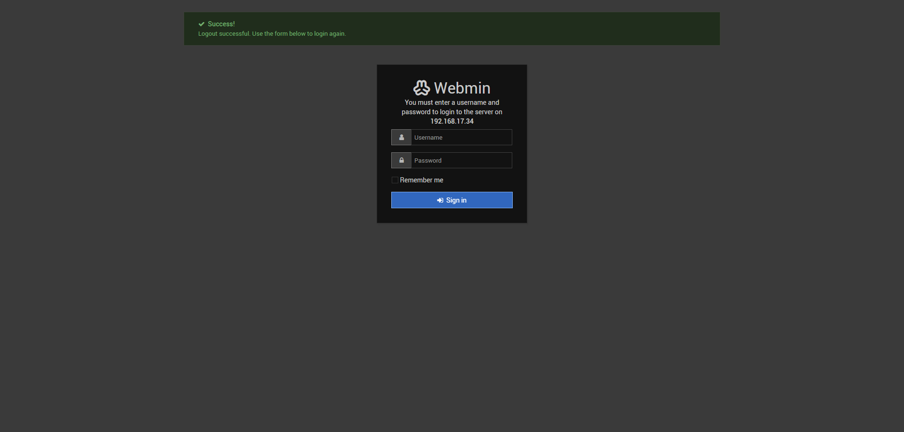
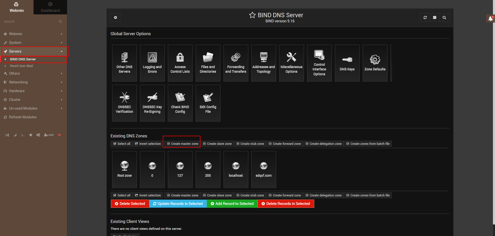
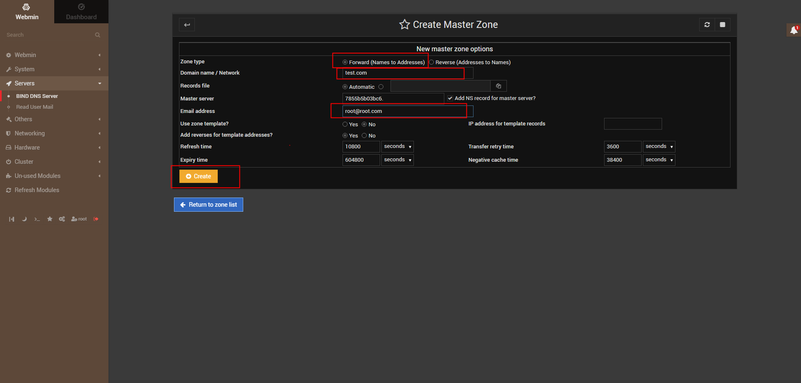
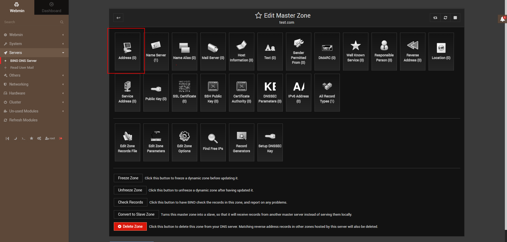
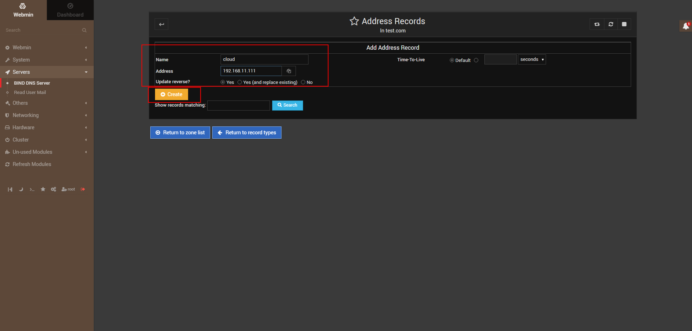
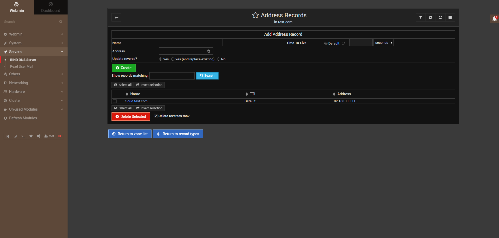

# BIND Handbook

# Install

```bash
mkdir -p /root/docker/bind

docker run --name bind -d --restart=always --publish 53:53/tcp --publish 53:53/udp --publish 10000:10000/tcp --volume /root/docker/bind:/data sameersbn/bind:9.16.1-20200524

# enter the container
docker exec -it bind bash

# set ssl mode to 0
sed -i '10s/.*/ssl=0/g' etc/webmin/miniserv.conf

# exit container exit 
cd /root/docker/bind/bind/etc
cat >> resolv.conf << EOF
nameserver 114.114.114.114
nameserver 8.8.8.8
EOF

chmod 775 resolv.conf
chown 101.101 resolv.conf

vi named.conf.options
# add a line
allow-query { any; };

# restart dns server
docker restart bind
```

# Configuration

> Username: root Password: password
> 











