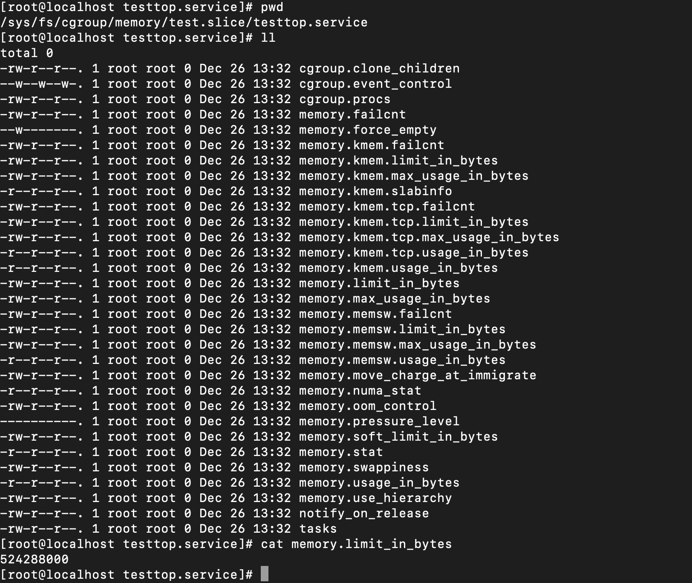

# Cgroup Handbook

本文基于 cgroup v1 进行描述，暂未涉及 v2 内容。

---

## Cgroup


cgroups 的全名叫做 Control Groups，他是 Linux Kernel 中的功能，可以用來限制，控制與隔離 Process 所使用到的系統資源，例如 CPU, Memory, Disk I/O, Network…等。

## Cgroup Function

### Resource Limiting

Group 可以设定 Memory 的使用上线，其中也包含 File System 的 Cache。

### Prioritization

不同的 Group 可以拥有不同的 CPU 和 Disk I/O 使用优先顺序。

### Accounting

用于计算 Group 内的资源使用状态，例如可以拿来当作计费的依据。

### Control

冻结或者重启一整个 Group 的 Process。

## Cgroup 概念

### Task

运行在操作系统内的 Process，在 cgroups 中被称为 Task。

### Subsystem

一种资源控制器，一个 Subsystem 负责管理一种资源，例如 CPU 或者时 Memory，以下列出一些常见的资源类型：

- blkio：限制 task 对于储存设备的读取；
- cpu：通过 scheduler 安排 cgroup 内 task 存取 CPU 资源；
- cpuacct：自动产生 cgroup 内的 task 使用 CPU 资源的报告；
- cpuset：为 cgroup 内的 task 分配一组单独的 CPU 核心和 memory；
- devices：控制 cgroup 中 task 可以存取的设备；
- freezer：暂停和恢复位于 cgroup 内的 task；
- memory：限制 task 可以使用的 memory，并且自动产生 cgroup 内 task 使用 memory 的报告；
- net_cls：对网络包标记 Class ID，进而 Linux Traffic Controller 根据这些 Class ID 得知网络包来自哪一个 cgoup 中的哪一个 task；
- net_prio：为每一个 Network Interface 提供动态设定网络流量优先权的方法；
- ns：有关于 Namespace 的 Subsystem；
- perf_event：用于辨别 task 属于哪一个 cgroup，而且可以用来做效能分析。

### Cgroup

cgroups 的资源控制单位，连接 task 和 subsystem，用于定义 task 的资源管理策略。

### Hierarchy

一群 cgroup 所组成的树状结构，每一个节点都是一个 cgroup，一个 cgroup 可以有多个子节点，子节点预设继承父节点的属性；

## Cgroup 管理工具

1. 通过文件系统使用：通过新增、修改、删除文件和文件夹来设置 cgroups；
2. 使用 libcgroup 内所提供的 cgcreate，cgexec 和 cgclassify 来管理；
3. rules engine daemon：通过 rules engine daemon 来设置 cgroups；
4. cgroups device：最主流的方式就是通过 systemd 和 cgroupfs 这种 cgroups Driver 来管理；

## Cgroup 文件介绍


- tasks：记录此 cgroup 所包含的 task 的 pid 列表，把某个 Process 的 pid 加到这个文件中，就等同于把该 Process 移到此 cgroup 中；
- cgroup.procs：此 cgroup 所包含的子 cgroup 列表，操作方式与 tasks 文件一致；
- notify_on_release：其值为 0 或 1，用来决定是否在 cgroup 被删除时发出通知，如果为 1，那当 cgroup 内最后一个 task 离开时，并且最后一个子 cgroup 也被删除，系统就会执行 release_agent 中的命令；
- release_agent：定义需要被执行的命令；

当删除子 group 时，如果子 group 的 tasks 中还存在 pid，它们会自动迁移到父 cgroup 中。

## Cgroup 相关命令

```
mount -t cgroup # 查看 cgroup 文件系统挂载路径
systemd-cgls # 查看系统 cgroup 列表
systemd-cgtop # cgroup 版的 top
systemctl set-property testtop.service BlockIOAccounting=true # 开启服务的资源统计
systemctl set-property testtop.service BlockIOWeight=100 # 设置 IO 权重
```

## 通过 systemd 管理 cgroup

### 查看 cgroup

```
systemd-cgls # 查看所有的 cgroup
```


### 创建临时的 cgroup

```
# 启动一个 service 名字为 testtop，并且指定 slice 为 test
# 如果 slice 不存在，则会自动创建
systemd-run --unit=testtop --slice=test top -b
```


自动生成 test.slice 目录在 /sys/fs/cgroup/{cpu, memory, …} 中。


```
ps -ef | grep top # 查看 top 命令的 pid
```

查看 top 进程的 cgroup 信息。


### 修改服务的资源限制

```
# 设置 toptest 服务的 CPU 和内存限制
systemctl set-property testtop.service CPUShares=600 MemoryLimit=500M
```

设置后重新查看该 top 进程的 cgroup 信息。


/sys/fs/cgroup/memory/test.slice 中新增 testtop.service 目录，同时 memory.limit_in_bytes 中记录所限制的值。



## 通过配置文件修改 cgroup

```
# 以 crond.service 为例
```


```
systemctl daemon-reload # 重新加载 unit
systemctl restart crond.service # 重新启动 crond.service
```

再次查看 crond.service 的资源限制情况。

