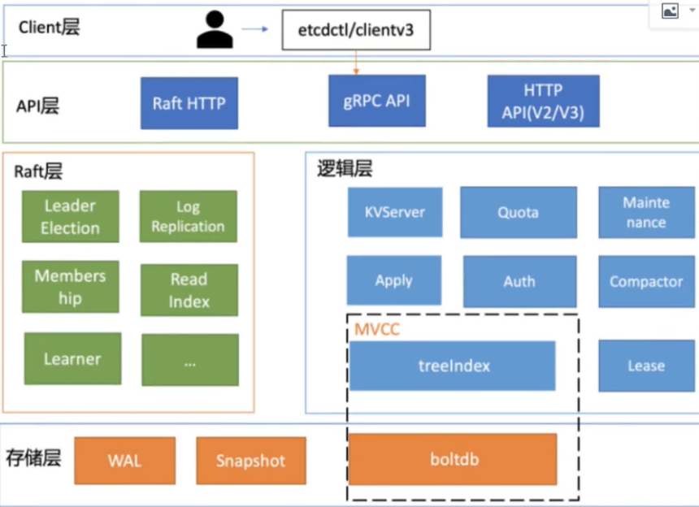

# Etcd Handbook

# **ETCD DEV**

在开始之前，请确保 go.mod 文件如下替换 bblot 和 grpc，否则 grant lease 将会无法执行；

```
module test

go 1.20

require github.com/coreos/etcd v3.3.25+incompatible

require (
    github.com/coreos/bbolt v0.0.0-00010101000000-000000000000 // indirect
    github.com/coreos/go-semver v0.3.1 // indirect
    github.com/coreos/go-systemd v0.0.0-20191104093116-d3cd4ed1dbcf // indirect
    github.com/coreos/pkg v0.0.0-20230601102743-20bbbf26f4d8 // indirect
    github.com/dgrijalva/jwt-go v3.2.0+incompatible // indirect
    github.com/dustin/go-humanize v1.0.1 // indirect
    github.com/gogo/protobuf v1.3.2 // indirect
    github.com/golang/groupcache v0.0.0-20210331224755-41bb18bfe9da // indirect
    github.com/golang/protobuf v1.5.3 // indirect
    github.com/google/btree v1.1.2 // indirect
    github.com/google/uuid v1.3.0 // indirect
    github.com/grpc-ecosystem/go-grpc-middleware v1.4.0 // indirect
    github.com/grpc-ecosystem/go-grpc-prometheus v1.2.0 // indirect
    github.com/grpc-ecosystem/grpc-gateway v1.16.0 // indirect
    github.com/jonboulle/clockwork v0.4.0 // indirect
    github.com/prometheus/client_golang v1.16.0 // indirect
    github.com/soheilhy/cmux v0.1.5 // indirect
    github.com/tmc/grpc-websocket-proxy v0.0.0-20220101234140-673ab2c3ae75 // indirect
    github.com/xiang90/probing v0.0.0-20221125231312-a49e3df8f510 // indirect
    go.uber.org/atomic v1.7.0 // indirect
    go.uber.org/multierr v1.6.0 // indirect
    go.uber.org/zap v1.24.0 // indirect
    golang.org/x/net v0.9.0 // indirect
    golang.org/x/sys v0.8.0 // indirect
    golang.org/x/text v0.9.0 // indirect
    golang.org/x/time v0.3.0 // indirect
    google.golang.org/genproto v0.0.0-20230629202037-9506855d4529 // indirect
    google.golang.org/genproto/googleapis/api v0.0.0-20230706204954-ccb25ca9f130 // indirect
    google.golang.org/genproto/googleapis/rpc v0.0.0-20230629202037-9506855d4529 // indirect
    google.golang.org/grpc v1.56.2 // indirect
    google.golang.org/protobuf v1.31.0 // indirect
    sigs.k8s.io/yaml v1.3.0 // indirect
)

replace github.com/coreos/bbolt => go.etcd.io/bbolt v1.3.4
replace google.golang.org/grpc => google.golang.org/grpc v1.26.0
```

```
package main

import (
        "context"
        "fmt"
        "log"
        "runtime"
        "testing"
        "time"

        "github.com/coreos/etcd/clientv3"
)

func TestEtcd(t *testing.T) {
        cli, err := clientv3.New(clientv3.Config{

                Endpoints:   [ ]string{"192.168.17.40:12379", "192.168.17.40:22379", "192.168.17.40:32379"},

                DialTimeout: 5 * time.Second,
        })
        if err != nil {
                log.Printf("err: %v", err.Error())
                return
        }
        defer cli.Close()

        ctx := context.TODO()

        // put a key
        if resp, err := cli.Put(ctx, "name", "golang"); err != nil {
                log.Printf("err: %v", err.Error())
        } else {
                fmt.Println(resp)
        }

        // get a key
        if resp, err := cli.Get(ctx, "name", clientv3.WithPrefix()); err != nil {
                log.Printf("err: %v", err.Error())
                return
        } else {
                fmt.Println(resp.Kvs)
        }

        // put a key with lease
        lease1 := clientv3.NewLease(cli)
        if resp, err := lease1.Grant(ctx, 5); err != nil {
                log.Printf("err: %v", err.Error())
                return
        } else {
                fmt.Println(resp)
                if _, err := cli.Put(ctx, "test_lease", "test", clientv3.WithLease(clientv3.LeaseID(resp.ID))); err != nil {
                        log.Printf("err: %v", err.Error())
                        return
                }
        }

        // auto renew lease
        lease2 := clientv3.NewLease(cli)
        if resp, err := lease2.Grant(ctx, 5); err != nil {
                log.Printf("err: %v", err.Error())
                return
        } else {
                if response, err := lease2.KeepAlive(ctx, resp.ID); err == nil {
                        go func() {
                                for {
                                        select {
                                        case keepResp := <-response:
                                                if keepResp == nil {
                                                        log.Println("lease cancel")
                                                        runtime.Goexit()
                                                } else {
                                                        log.Println("renew lease")
                                                }
                                        }
                                }
                        }()
                }
                if _, err := cli.Put(ctx, "test_auto_renew_lease", "test", clientv3.WithLease(clientv3.LeaseID(resp.ID))); err != nil {
                        log.Printf("err: %v", err.Error())
                        return
                }

        }

        select {}

}
```

# **ETCD OPS**

## **WHAT IS ETCD？**

ETCD 是一个使用 GOLANG 编写的分布式、高可用的一致性键值存储系统，用户提高可靠的分布式键值存储、配置共享和服务发现等服务；



CLIENT 层：包括 CLIENT V2 和 V3 两个大版本 API 客户端库，提供了简洁易用的 API，同时支持负载均衡、节点间故障自动转移，可极大降低业务使用 ETCD 复杂度，提升开发效率、服务可用性；

API 网络层：API 网络层主要包括 CLIENT 访问 SERVER 和 SERVER 节点之间的通信协议。在使用 CLIENT 访问 SERVER 的 API V2 版本中使用 HTTP/1.x 协议，V3 版本中使用 GRPC 协议，同时 V3 通过 ETCD GRPC-GATEWAY 组件也支持了 HTTP/1.x 协议，便于各语言的服务调用；

RAFT 算法层：实现了 LEADER 选举、日志复制、READINDEX 等核心算法特征，用于保证 ETCD 多个节点间的数据一致性、提升服务可用性等，是 ETCD 的核心；

功能逻辑层：核心特征的实现层，如 KVSERVER 模块、MVCC 模块、AUTH 鉴权模块、LEASE 租约模块、COMPACTOR 压缩模块，其中 MVCC 模块由 TTREEINDEX 和 BOLTDB 模块组成；

存储层：包含预写日志模块、SNAPSHOT 模块、BOLTDB 模块，其中 WAL 可保证 ETCD CRASH 后数据不丢失，BOLTDB 则包含了集群元数据和用户写入的数据；

## **HOW TO INSTALL CLUSTER?**

ETCD 有三种方式可以实现集群搭建：

静态配置：通过手动配置进行，通常比较适用于线下环境，由于 ETCD CLUSTER 中各 MEMBER 需要相互感知到对方，因此在启动集群时需要知道集群节点个数以及各节点的地址；

```
# you need configure the network in docker first, ignore it if it's on different machines ignore
# node1: etcd1, node2: etcd2, node3: etcd3
# node1: 10.3.36.1, node2: 10.3.36.2, node3: 10.3.36.3
mkdir -p ~/docker/{etcd1,etcd2,etcd3}
sudo chmod -R 777 ~/docker/{etcd1,etcd2,etcd3}

docker network create --driver bridge --subnet=10.3.36.0/16 --gateway=10.3.1.1 etcd_network

docker run -d --restart=always \
--privileged=true \
--network etcd_network \
-p 12379:2379 \
-p 12380:2380 \
-v ~/docker/etcd1:/etcd-data \
--name etcd1 \
--ip 10.3.36.1 \
quay.io/coreos/etcd:v3.4.26 \
/usr/local/bin/etcd \
--name etcd1 \
--data-dir /etcd-data \
--listen-client-urls http://0.0.0.0:2379 \
--listen-peer-urls http://0.0.0.0:2380 \
--advertise-client-urls http://10.3.36.1:2379 \
--initial-advertise-peer-urls http://10.3.36.1:2380 \
--initial-cluster etcd1=http://10.3.36.1:2380,etcd2=http://10.3.36.2:2380,etcd3=http://10.3.36.3:2380 \
--initial-cluster-token wengy \
--initial-cluster-state new \
--log-level info \
--logger zap \
--log-outputs stderr

docker run -d --restart=always \
--privileged=true \
--network etcd_network \
-p 22379:2379 \
-p 22380:2380 \
-v ~/docker/etcd2:/etcd-data \
--name etcd2 \
--ip 10.3.36.2 \
quay.io/coreos/etcd:v3.4.26 \
/usr/local/bin/etcd \
--name etcd2 \
--data-dir /etcd-data \
--listen-client-urls http://0.0.0.0:2379 \
--listen-peer-urls http://0.0.0.0:2380 \
--advertise-client-urls http://10.3.36.2:2379 \
--initial-advertise-peer-urls http://10.3.36.2:2380 \
--initial-cluster etcd1=http://10.3.36.1:2380,etcd2=http://10.3.36.2:2380,etcd3=http://10.3.36.3:2380 \
--initial-cluster-token wengy \
--initial-cluster-state new \
--log-level info \
--logger zap \
--log-outputs stderr

docker run -d --restart=always \
--privileged=true \
--network etcd_network \
-p 32379:2379 \
-p 32380:2380 \
-v ~/docker/etcd3:/etcd-data \
--name etcd3 \
--ip 10.3.36.3 \
quay.io/coreos/etcd:v3.4.26 \
/usr/local/bin/etcd \
--name etcd3 \
--data-dir /etcd-data \
--listen-client-urls http://0.0.0.0:2379 \
--listen-peer-urls http://0.0.0.0:2380 \
--advertise-client-urls http://10.3.36.3:2379 \
--initial-advertise-peer-urls http://10.3.36.3:2380 \
--initial-cluster etcd1=http://10.3.36.1:2380,etcd2=http://10.3.36.2:2380,etcd3=http://10.3.36.3:2380 \
--initial-cluster-token wengy \
--initial-cluster-state new \
--log-level info \
--logger zap \
--log-outputs stderr
```

服务发现：使用现有的 ETCD CLUSTER 来进行注册和启动。DISCOVERY SERVICE PROTOCOL 来帮助新的 ETCD MEMBER 使用共享 URL 在集群引导阶段发现所有其他 MEMBER。该协议使用新的发现令牌来引导一个唯一的 ETCD CLUSTER，一个发现令牌只能代表一个 ETCD CLUSTER，只要此令牌上的发现协议启动，即使中途失败也不会引导到另一个 ETCD 集群；

```
# you need configure the network in docker first, ignore it if it's on different machine
# node1: etcd1, node2: etcd2, node3: etcd3
# node1: 10.3.36.1, node2: 10.3.36.2, node3: 10.3.36.3
mkdir -p ~/docker/{etcd1,etcd2,etcd3}
sudo chmod -R 777 ~/docker/{etcd1,etcd2,etcd3}

docker network create --driver bridge --subnet=10.3.36.0/16 --gateway=10.3.1.1 etcd_network
curl https://discovery.etcd.io/new?size=3

docker run -d --restart=always \
--privileged=true \
--network etcd_network \
-p 12379:2379 \
-p 12380:2380 \
-v ~/docker/etcd1:/etcd-data \
--name etcd1 \
--ip 10.3.36.1 \
quay.io/coreos/etcd:v3.4.26 \
/usr/local/bin/etcd \
--name etcd1 \
--data-dir /etcd-data \
--listen-client-urls http://0.0.0.0:2379 \
--listen-peer-urls http://0.0.0.0:2380 \
--advertise-client-urls http://10.3.36.1:2379 \
--initial-advertise-peer-urls http://10.3.36.1:2380 \
--discovery https://discovery.etcd.io/30cc0bb80fbd6b5b733b8d0672170f36 \
--log-level info \
--logger zap \
--log-outputs stderr

docker run -d --restart=always \
--privileged=true \
--network etcd_network \
-p 22379:2379 \
-p 22380:2380 \
-v ~/docker/etcd2:/etcd-data \
--name etcd2 \
--ip 10.3.36.2 \
quay.io/coreos/etcd:v3.4.26 \
/usr/local/bin/etcd \
--name etcd2 \
--data-dir /etcd-data \
--listen-client-urls http://0.0.0.0:2379 \
--listen-peer-urls http://0.0.0.0:2380 \
--advertise-client-urls http://10.3.36.2:2379 \
--initial-advertise-peer-urls http://10.3.36.2:2380 \
--discovery https://discovery.etcd.io/30cc0bb80fbd6b5b733b8d0672170f36 \
--log-level info \
--logger zap \
--log-outputs stderr

docker run -d --restart=always \
--privileged=true \
--network etcd_network \
-p 32379:2379 \
-p 32380:2380 \
-v ~/docker/etcd3:/etcd-data \
--name etcd3 \
--ip 10.3.36.3 \
quay.io/coreos/etcd:v3.4.26 \
/usr/local/bin/etcd \
--name etcd3 \
--data-dir /etcd-data \
--listen-client-urls http://0.0.0.0:2379 \
--listen-peer-urls http://0.0.0.0:2380 \
--advertise-client-urls http://10.3.36.3:2379 \
--initial-advertise-peer-urls http://10.3.36.3:2380 \
--discovery https://discovery.etcd.io/30cc0bb80fbd6b5b733b8d0672170f36 \
--log-level info \
--logger zap \
--log-outputs stderr
```

DNS 发现：通过 DNS 查询方式获取其他节点地址信息；

```
TODO
```

## **COMMAND**

```
etcdctl --endpoints={{IP_ADDR:PORT}} --user='{{USERNAME}}' --password='{{PASSWORD}}' {{COMMAND}}
#############################################################
# put a key
etcdctl put {{KEY}} {{VALUE}}
# get a key
etcdctl get {{KEY}}
# get a key in json format
etcdctl get {{KEY}} -w=json
# get the value of the old version of the key
etcdctl get {{KEY}} --rev={{VERSION}}
# get all keys of the range
etcdctl get {{KEY}} {{KEY}}
# get all keys of prefix and limit the number
etcdctl get --prefix {{KEY}} --limit {{NUMBER}}
# get all keys starting from {{KEY}}
ectdctl get --from-key {{KEY}}
# del a key
etcdctl del {{KEY}}
# del a key return key and value
etcdctl del {{KEY}} --prev-kv
# del all keys of the range
etcdctl del {{KEY}} {{KEY}}
#############################################################

# watch a key
etcdctl watch {{KEY}}
# generate a lease
etcdcl lease grant {{TTL}}
# set lease for a key
etcdctl put --lease={{LEASE}} {{KEY}} {{VALUE}}
# revoke lease for a key
etcdctl lease revoke {{LEASE}}
# fresh lease
etcdctl lease keepalived {{LEASE}}
# get lease ttl
etcdctl lease timetolive {{LEASE}}
# get lease ttl and return all keys
etcdctl lease timetolive --keys {{LEASE}}

#############################################################
# add user
etcdctl user add {{USERNAME}}
# del user
etcdctl user del {{USERNAME}}
# change passwd
etcdctl user pass
# grant role for user
etcdctl user grant-role {{USERNAME}} {{ROLE}}

#############################################################
# check auth status
etcdctl auth status
# enable auth
etcdctl auth enable
# add role
etcdctl role add {{ROLE}}
# grant permission for role
etcdctl role grant-permission {{read/write/readwrite}} {{KEY}}

#############################################################

```

## **READ OPERATION PROCESSING FLOW**

1. 首先，ETCDCTL 会对命令中的参数进行解析；
2. 解析完请求中的参数之后，ETCDCTL 会创建一个 CLIENT V3 库对象，使用 KVSERVER 模块的 API 来访问 ETCD SERVER。ETCD CLIENT V3 库采用的负载均衡算法为 ROUND-ROBIN，通过轮询方式依次从 ENDPOINT 列表中选择一个进行访问，使得 ETCD SERVER 负载尽量均衡；
3. 当 CLIENT 发送 RANGE RPC 请求到了 SERVER 就进入 KVSERVER 模块。KVSERVER 中有着一系列的拦截器，例如：日志、请求行为检查、来源 IP、执行耗时及错误码等，拦截器提供了在执行一个请求前后的 HOOK 能力。ETCD 还基于拦截器实现了一个集群必须要有 LEADER 和 当请求延时超过指定阈值时，打印包含来源 IP 的慢查询日志特性；
4. 当 CLIENT 发起写请求后，LEADER 将会收到（如果请求的节点不是 LEADER，则请求将会转发至 LEADER 节点），后将请求持久化到 WAL 日志，并广播到各个节点。当一半以上的节点持久化日志成功，则该请求日志被标记为已提交，后各 ETCDSERVER 模块异步从 RAFT 模块获取已提交的日志条目，应用到 BOLTDB；
    1. 在各节点提交写操作时，会造成一定时间内的数据不一致，因此 ETCD 提供了两种读模式；
    2. 串行读：直接读取 BOLTDB 数据返回，无需通过 RAFT 协议与集群进行交互，具有低延时、高吞吐的特点，适合对数据一致性要求不高的场景；
    3. 线性读：默认模式，需要经过 RAFT 协议模块，反映的是集群共识，因此在延时和吞吐量上相对略差，适用于数据一致性要求高的场景；
    4. READINDEX：ETCD 3.1 引入，保证串行读也可以保证数据高一致性。当收到一个线性读请求时，首先会从 LEADER 节点获取最新的提交索引。LEADER 收到 READINDEX 请求时，为了防止脑裂等异常场景，会向 FOLLOWER 节点发送心跳确认，当一半节点确认 LEADER 身份后才能将提交索引返回给接收到线性读请求的节点。在此期间，收到线性读请求的节点会等待，直到 BOLTDB 已应用索引大于 LEADER 提交节点时，才会返回数据；
5. ETCD 采用 TREEINDEX 和 BOLTDB 实现 MVCC。每次修改操作，生成一个新版本号，版本号为 KEY，VALUE 为 KEY-VALUE 等信息组成的结构体存储到 BLOBDB。读取时先从 TREEINDEX 中获取 KEY 的版本号，再以版本号作为 BOLTDB 的 KEY，从 BOLTDB 中获取 VALUE 的信息。但是不是所有请求都一定要从 BOLTDB 中获取数据，ETCD 会首先尝试从一个内存读事务 BUFFER 中进行二分查找，如果命中则直接返回，否则向 BOLTDB 模块进行查询；

## **WRITE OPERATION PROCESSING FLOW**

1. 首先，ETCDLCTL 会对命令中的参数进行解析；
2. 解析完请求中的参数之后，ETCDCTL 会创建一个 CLIENT V3 库对象，首先请求 QUOTA 模块，来验证当前所分配的空间是否充足，然后将请求转发至 KVSERVER 进行限速、鉴权等操作（如果该节点不是 LEADER 节点，则还需要将请求转发至 LEADER 节点）。
    1. QUOTA：用户检查当下 ETCD DB 大小加上所请求写入的 KEY-VALUE 大小是否超过配额，默认为 2 G，不建议超过 8 G；
    2. KVSERVER：将 PUT 写请求内容打包成一个提案消息，提交给 RAFT 模块。同时在提交提案之前还有限速、鉴权和大包检查；
    3. 限速：当 RAFT 模块已提交的日志索引超过已应用到 BOLTDB 的日志索引 5000 时，返回 etcdserver: too many requests 错误；
    4. 鉴权：若使用了密码鉴权、请求中携带了 TOKEN，但是 TOKEN 无效，则返回 auth: invalid auth token 错误；
    5. 大包检查：当写入的包大小超过默认的 1.5 MB，则返回 etcdserver: request is too large 错误；
3. 如果是集群，则需要通过 RAFT HTTP 接口将请求分发至各个 FOLLOWER 节点，如果超过半数节点 WAL 持久化成功，则该 COMMIT 标记为已提交；
    1. WAL 结构：TYPE + CRC + DATA；
    2. WAL.DATA：TERM（LEADER 任期号） + INDEX（日志条目索引）+ INDEX + DATA
4. 当 COMMIT 被标记为已提交之后，会请求 APPLY 模块，然后通过 MVCC 进行数据的存储工作；
    1. APPLY：用于执行已提交状态的提案，将其更新到状态机（BLOTDB）。如果在执行过程中 CRASH，重启后主要依赖 WAL 日志进行找回，并再次执行。同时通过 CONSISTENT INDEX 字段来存储系统当前已经执行过的日志条目索引，实现幂等性；
    2. MVCC：主要是由 TREEINDEX 和 BLOTDB 两个部分。其中 TREEINDEX 保存 KEY 的历史版本号，BLOTDB 存储用户存储的具体 KEY-VALUE；

## **CAP**

### **CAP THEOREM**

分布式系统的三个指标，即 CAP 定理的三要素：

- 一致性
- 可用性
- 分区容忍性

CAP 定理指的是，这三个要素中最多只能同时实现两点，不可能三者兼顾。因此在进行分布式架构设计时，必须做出取舍。而对于分布式数据系统，分区容忍性是基本要求，否则就失去了价值。因此设计分布式数据系统，就是在一致性和可用性之间取一个平衡。而对于大多数 Web 应用，其实并不需要强一致性，因此牺牲一致性而换取高可用性，是目前多数分布式数据库产品的方向；

当然，牺牲一致性，并不是完全不管数据的一致性，否则数据是混乱的，那么系统可用性再高分布式再好也没有了价值。牺牲一致性，只是不再要求关系型数据库中的强一致性，而是只要系统能达到最终一致性即可，考虑到客户体验，这个最终一致的时间窗口，要尽可能的对用户透明，也就是需要保障 “用户感知到的一致性”。通常是通过数据的多份异步复制来实现系统的高可用和数据的最终一致性的，”用户感知到的一致性” 的时间窗口则取决于数据复制到一致状态的时间；

下面这个例子，可以解释为啥 C、A 和 P 这三者为什么不能同时满足：

假设有两台机器 A、B，两者之间互相同步保持数据的一致性。因为网络抖动是客观存在的事实，现在 B 由于网络原因不能与 A 通信（Network Partition），假设某个客户端向 A 写入数据，现在有两种选择：

1. A 拒绝写入，这样能保证与 B 的一致性，但是牺牲了可用性；
2. A 允许写入，但是这样就不能保证与 B 的一致性了；

Network Partition 是必然的，网络非常可能出现问题（断线、超时），因此 CAP 理论一般只能 AP 或 CP，而 CA 一般较难实现；

- CP: 要实现一致性，则需要一定的一致性算法，一般是基于多数派表决的，如 PAXOS 和 Raft；
- AP: 要实现可用性，则要有一定的策略决议到底用哪个数据，并且数据一般要进行冗余备份（REPLICATION），比如 REDIS 集群中使用的 GOSSIP 协议；

当然，在上面的例子中，A 可以先允许写入，等 B 的网络恢复以后再同步至 B（根据 CAP 原理这样不能保证强一致性了，但是可以考虑实现最终一致性）；

### **EVENTUAL CONSISTENCY**

对于一致性，可以分为从客户端和服务端两个不同的视角。从客户端来看，一致性主要指的是多并发访问时更新过的数据如何获取的问题。从服务端来看，则是更新如何复制分布到整个系统，以保证数据最终一致。一致性是因为有并发读写才有的问题，因此在理解一致性的问题时，一定要注意结合考虑并发读写的场景；

从客户端角度，多进程并发访问时，更新过的数据在不同进程如何获取的不同策略，决定了不同的一致性。对于关系型数据库，要求更新过的数据能被后续的访问都能看到，这是强一致性。如果能容忍后续的部分或者全部访问不到，则是弱一致性。如果经过一段时间后要求能访问到更新后的数据，则是最终一致性；

## **RAFT**

RAFT 算法是现在分布式系统开发首先的共识算法，本质上来说，RAFT 算法是通过一切以领导者为准的方式， 实现一系列值得共识和各节点日志的一致；

共识算法的祖师爷是 PAXOS，但是由于它过于复杂，导致难以理解和落地。RAFT 算法正是为了可理解性、易实现而诞生的。它通过问题分解，将复杂的共识问题拆成了三个子问题，分别是：

- LEADER 选举：LEADER 故障后集群能快速选出新 LEADER；
- 日志复制：集群只有 LEADER 能写入日志，LEADER 负责复制日志到 FOLLOWER 节点，并强制 FOLLOWER 节点与自己保持一致；
- 安全性：一个任期内集群只能产生一个 LEADER，已提交的日志条目在发送 LEADER 选举时，一定会存在更高任期的新 LEADER 日志、各节点中的状态机的任意位置的日志条目内容应该相同；

### **LEADER ELECTION**

在 RAFT 协议中它定义了集群中的节点肯定处于其中一个状态：

- FOLLOWER：同步从 LEADER 收到的日志，ETCD 启动时的默认状态；
- CANDIDATE：可以发起 LEADER 选举；
- LEADER：集群领导者，唯一性，拥有同步日志的权限， 需要定时广播心跳给 FOLLOWER 节点；

在 ETCD 3.4 版本中引入一个预投票机制，当出现网络分区的情况时，发起投票的节点在预投票环节无法获得超过一半的节点的同意，因此 TERM 号不会自增；

当节点收到选举投票时，需要检查候选者的最后一条日志中的任期号：

- 若小于自己则拒绝投票；
- 若任期号相同，日志却比自己低，也拒绝投票；

### **TERM**

RAFT 协议将时间划分为一个个任期，任期用连续的整数表示，每个任期从一次选举开始，赢得选举的节点在该任期内充当 LEADER 职责，随着时间的消逝，集群可能会发生新的选举，任期号也会单调递增。

通过任期号，可以比较各个节点的数据新旧、识别过期的 LEADER 等，它在 RAFT 算法中充当逻辑时钟，发挥着重要作用；

## **TREEINDEX**

在 TREEINDEX 每一个节点的 KEY 存放着一个 KEYINDEX 结构，ETCD 就是通过它保存了用户的 KEY 和版本号的映射关系。同时还存储 KEY 的若干代版本信息，每代中包含对 KEY 的多次修改的版本列表。GENERATION 表示一个 KEY 从创建到删除的过程，每代对应 KEY 的一个生命周期的开始与结束。当你第一次创建一个 KEY 时，会生成第 0 代，后续的修改操作都是往第 0 代中追加修改版本号。当把 KEY 删除之后，它就会生成新的第 1 代；

```
type keyIndex struct {

        key [ ]byte
        modified revision
        generations [ ]generation

}

type generation struct {
        ver int64
        created revision
        revs [ ]revision

}

type revision struct {
        main int64
        sub int64
}
```

## **MVCC**

1. 每个事务都有唯一事务 ID， 在 ETCD 中叫做 MAIN ID，全局递增不重复；
2. 一个事务可以包含多个修改操作，每一个操作叫做一个 REVISION，共享同一个 MAIN ID；
3. 一个事务内多个修改操作会被从 0 递增编号，这个编号被称为 SUB ID；
4. 每个 REVISION 是由（MAIN ID，SUB ID）唯一标识；
- REVISION 标识改动序号，每次 KV 的变化，LEADER 节点都会修改 REVISION 值 。因此这个值在 CLUSTER 内是全局唯一的，而且也是递增的；
- MODREVISION：记录了某个 KEY 最近修改时的 REVISION，即它是与 KEY 关联的；
- VERSION：表示 KV 的版本号，初始值为 1，每次修改 KV 对应的 VERSION 都会加 1，也就是说它是作用于 KV 之内的；

# **DONE**