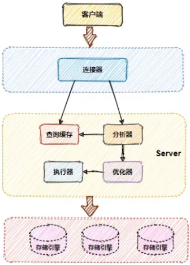

# MySQL Handbook

# **MYSQL DEV**




## **DQL**

数据查询语言，数据检索语句，用于从表中获取数据；

- select：查询数据表中的记录；

## **DDL**

数据定义语言，用户定义和管理数据库中的所有对象的语言，对数据库的某些对象（数据库，数据表）进行管理。操作对象包括数据库本身以及数据库对象。DDL 操作是隐形提交的，不可回滚；

- create：创建数据库和数据表；
- drop：删除数据库、数据表、索引、触发器、条件约束以及数据表的权限；
- alter：修改数据表定义以及属性；
- truncate：清空数据表中的数据；

## **DML**

数据操作语言，用户操作数据库对象中包含的数据，操作的对象是记录。DML 操作可以手动控制事务的开启、提交和回滚；

- insert：向数据表中插入记录；
- delete：删除数据表中的记录；
- update：更新数据表中的记录；

## **DCL**

数据控制语言，操作对象是数据库的权限，并控制数据库操纵事务发送的时间和效果，对数据库进行监视等；

- grant：允许对象的创建者给某个用户或某组或所有用户某些特定的权限；
- revoke：可以撤销某用户或某组或所有用户某些特定的权限；

## **TCL**

事务控制语言，用于控制事务；

- rollback：用于事务的回退操作；
- savepoint：为回退而存在，个数没有限制与快照类似。savepoint 是事务中的一点，用于取消部分事务，当结束事务时，所有 savepoint 将被刹删除；
- commit：用于事务的提交操作；
- set transaction：设置事务的各种状态，例如只读、读 / 写、隔离级别；

## **HOW DATA IS STROED？**

每创建一个数据库都会在数据存放路径里存放一个以 DATABASE 为名的目录，然后保存表结构和表数据的文件都会存放在这个目录里；

- .opt：用来存储当前数据库的默认字符集和字符校验规则；
- .frm：存储表结构，在 MYSQL 中建立一张表都会生成一个 .frm 文件；
- .ibd：表的数据将会保存在这个文件中。表数据既可以存在共享表空间文件（ibdata1）里，也可以存放在独占表空间文件中，这个行为是参数 innodb_file_per_table 控制的，若参数值为 1，则会将数据、索引等信息单独存储在一个独占表空间；

数据表空间由段（SEGMENT）、区（EXTENT）、页（PAGE）、行（ROW）组成，InnoDB 存储引擎的逻辑存储结构大致如下：


1. 行

数据库表中的记录都是按照 ROW 进行存放的，每行记录根据不同的格式，有不同的存储结构；

1. 页

记录是按照 ROW 来进行存储的，但是数据库的读取并不以 ROW 为单位，否则一次读取只能处理一行数据，效率会非常低。因此 InnoDB 的数据是按照 PAGE 的单位来读写的，也就是说，当需要读取一条记录的时候一次将会以 PAGE 的单位进行读取，存入内存；

默认每个页的大小为 16 KB，页是 InnoDB 存储引擎磁盘管理的最小单元，意味着数据库每次读写都是以 16 KB 为单位的，一次最少从磁盘中读取 16 KB 的内容放到内存，一次最少把内存中 16 KB 内容刷新到磁盘中；

1. 区

在 InnoDB 存储引擎中使用 B+ 树来组织数据的，B+ 树中每一层都是通过双向链表连接起来的，如果是以 PAGE 来分配存储空间，那么链表中相邻的两个 PAGE 之间的物理位置并不是连续的，会造成大量随机的 I/O；

因此在分配空间的时候就不能再按照 PAGE 进行单位分配了，而是要按照 EXTENT 为单位进行分配，每个 EXTENT 的大小为 1 MB，每连续的 64 个 PAGE 就会被划为一个 EXTENT，这样就可以使得链表中相邻的 PAGE 物理位置相邻，形成顺序 I/O；

1. 段

数据表空间是由各个 SEGMENT 组成的，段是由多个 EXTENT 组成，段一般分为数据段、索引段和回滚段等；

- 索引段：存放 B+ 树的非叶子节点的区的集合；
- 数据段：存放 B+ 树的叶子节点的区的集合；
- 回滚段：存放的是回滚数据的区的集合；

### **WHAT ARE THE INNODB ROW FORMATS?**

行格式：一条记录的存储结构；

InnoDB 提供了 4 种行格式，分别是 Redundant、Compact、Dynamic、和 Compressed 行格式；

- Redundant：不是一种紧凑的行格式，现已不使用；
- Compact：一个紧凑的行格式，设计的初衷是为了让一个数据页中可以存放更多的行记录，从 MYSQL 5.1 之后被设置为默认格式；
- Dynamic & Compressed：两个都是紧凑的行格式，都是基于 Compact 改进，从 MYSQL 5.7 之后默认使用 Dynamic；

### **WHAT DOES THE COMPACT ROW FORMAT LOOK LIKE?**


一条记录由记录的额外信息和记录的真实数据两个部分组成。记录的额外信息包含 3 个部分：变长字段长度列表、NULL 值列表、记录头信息；

- 变长字段长度列表：会保存当前记录中所有 varchar 类型字段的长度且以逆序的方式进行存放。同时变长字段长度列表并不是必须的；
- NULL 值列表：表中的某些列可能存储 NULL 值，如果把这些 NULL 值都放到记录的真实数据中会比较浪费空间，因此将 NULL 的列存储在 NULL 值列表中。如果存在允许 NULL 值的列，则每个列对应一个二进制位，按照列的顺序逆序排序，当不足 8 位时高位补 0，超出 8 位则自动扩容 8 位。同时 NULL 值列表并不是必须的。
- 记录头信息：记录头信息中包含的内容很多，比较重要的有 delete_mask：用于标识该条数据是否删除，因此可以得知，当我们执行 delete 时只是将这个标识设置为 1，并不是真正删除记录。next_record：下一条记录的位置，从这里可以得知，记录和记录之间是通过链表连接的。record_type记录：表示当前记录的类型，0 表示普通记录，1 表示 B+ 树非叶子节点记录，2 表示最小记录，3 表示最大记录；

记录真实数据部分除了我们定义的字段以外还有三个隐藏字段：row_id、trx_id、roll_pointer；

- row_id：如果建表时指定了主键或者唯一约束列，则不会有 row_id 字段，否则 InnoDB 就会为记录添加 row_id 字段。row_id 字段占用 6 个字节；
- trx_id：每个记录都有 trx_id 字段，表示这个记录是由哪个事务生产的。trx_id 占用 6 个字节；
- roll_pointer：该字段是必须的，占用 7 个字节，用于记录上一个版本的指针；

### **WHAT IS THE MAXIMUM LENGTH OF VARCHAR?**

首先说明，MYSQL 规定除了 TEXT、BLOBs 这种大对象类型之外，其他的所有列占用的长度加起来不能超过 65535 个字节；

其次 varchar 类型具体能存储多少个字符还要取决于字符集，后计算变长字段的变成字段长度需要用几个字节表示。如果变长字段允许存储的最大字节数小于 255 字节，就会用 1 个字节表示，大于 255 字节则用 2 个字节表示；

假设限制字符集为 ascii，每一个字符占一个字节，变长字段的变长字段长度大于 255 字节，那么 varchar 的最大长度应该为：65535 - 2 - NULL 值列表所占用的字节数；

### **HOW DOES MYSQL HANDLE ROW OVERFLOW？**

MYSQL 中磁盘和内存交互的基本单位是 PAGE，一个 PAGE 的大小一般是 16348 字节，而一个 varchar 的列最多可以存储 65532 字节，这时一个 PAGE 可能就存不了一条记录，就会发生行溢出；

当发生行溢出时，InnoDB 存储引擎会自动将溢出的数据存放到溢出页中。此时在真实数据处只会保存该列的已部署数据，然后将剩余的数据放在溢出页中，然后在真实数据处用 20 字节存储指向溢出页的地址；


## **TRANSACTION**

### **WHAT ARE THE FEATURE OF TRANSACTION？**

事务是由 MYSQL 的引擎来实现的，我们常用的 InnoDB 引擎是支持事务的，而 MYISAM 引擎 就不支持事务，也因为如此，大多数 MYSQL 引擎 都采用 InnoDB；

事务需要遵循 4 个特性（ACID）：

1. 原子性：一个事务中的所有操作，要么全部完成，要么全部都不完成。当事务在执行过程中发生错误，会被回滚到事务开始前的状态；
2. 一致性：事务操作前和操作后，数据满足完整性约束，数据库保持一致性状态；
3. 隔离性：数据库允许多个并发事务同时对其读写和修改的能力，隔离性可以防止多个事务并发执行时由于交叉执行而导致的数据的不一致，因为多个事务同时使用相同的数据时，不会相互干扰，每个事务都有一个完整的数据空间；
4. 持久性：事务处理结束后，对数据的修改就是永久的，即便系统故障也不会丢失；

InnoDB 是通过上面技术来保证事务的 ACID 特性呢？

- 持久性：通过 REDO LOG 来保证；
- 原子性：通过 UNDO LOG 来保证；
- 隔离性：通过 MVCC 或者 锁机制来保证；
- 一致性：通过持久性 + 原子性 + 隔离性来保证；

### **WHAT PROBLEMS CAN PARALLEL TRANSACTIONS CAUSE？**

1. 脏读：如果一个事务读到了未提交的事务修改过的数据，就意味着发生了脏读现象；
2. 不可重复读：在一个事务内多次读取同一个数据，如果前后两次读到的数据不一致，就意味着发生了不可重复读现象；
3. 幻读：在一个事务内多次查询某个符合查询条件的记录数量，如果出现前后两次查询到的记录数量不一样的情况，就意味着发生了幻读现象；

### **WHAT ARE THE TRANSACTION ISOLATION LEVELS?**

对于并发事务可能会造成的问题，SQL 标准提出了四种隔离级别来规避这些现象，隔离级别越高，性能效率就越低，级别从低到高如下：

1. 读未提交：指一个事务未提交时，它做的变更就能被其他事务看到；
2. 读提交：指一个事务提交之后，它做的变更才能被其他事务看到；
3. 可重复读：指一个事务执行过程中看到的数据，一直跟这个事务启动时看到的数据是一致的。MYSQL InnoDB 引擎的默认隔离级别；
4. 串行化：会对记录加上读写锁，在多个事务对这条记录进行读写操作时，如果发生了读写冲突时，后访问的事务必须等前一个事务执行完成才能继续；

也就是说，在读未提交的级别下，可能所有问题都有可能发生。在读提交的级别下，不会发生脏读现象。在可重复读的级别下，只可能发生幻读现象。在串行化的级别下，所有问题都不会发生；

MYSQL InnoDB 引擎的默认隔离级别虽然是可重复读，但是它很大程度上避免了幻读现象：

- 针对快照读，通过 MVCC 方式解决了幻读；
- 针对当前读，通过 NEXT-KEY LOCK 方式解决了幻读；

### **HOW IS THE ISOLATION LEVEL IMPLEMENTED？**

对于读未提交的隔离级别的事务来说，直接读取最新的数据即可；

对于串行化的隔离级别的事务来说，通过加读写锁来避免并行访问；

对于读提交和可重复读的隔离事务来说，它们是通过 READ VIEW 来实现的，这两种事务等级的区别在于创建 READ VIEW 的时机不同，可以把 READ VIEW 看作一个数据快照；

读提交的隔离级别是在每个语句执行前都会重新生成一个 READ VIEW；

可重复读的隔离级别是在启动事务时生成一个 READ VIEW，然后整个事务期间都在用这个 READ VIEW；

## **LOCK**

1. 全局锁

当设置全局锁的时候，整个数据库就只处于只读状态。全局锁主要应用于全库逻辑备份，这样在备份数据库期间，不会因为数据或表结构的更新，而出现备份文件的数据与预期不一致；

1. 表级锁

表锁：可以实现对单表设置写锁，或者对单表进行读锁，这样所有线程对该表进行写操作或者读操作时就会阻塞，直到锁被释放；

元数据锁（MDL）：我们不需要显式地使用 MDL，因为当我们对数据库表进行操作时候，会自动给该表加上 MDL。MDL 是为了保证当用户对表执行 CURD 操作时，防止其他线程对这个表结构做了变更。MDL 是在事务提交后才会释放，这意味着事务执行期间，MDL 是一直持有的；

意向锁：意向共享锁和意向独占锁是表级锁，不会和行级的共享锁和独占锁发生冲突，而且意向锁之间也不会发生冲突，只会和共享表锁和独占表锁发生冲突。意向锁的目的是为了快速判断表里是否有记录被锁；

AUTO-INC 锁：数据表中主键的值递增主要是通过 AUTO-INC 锁实现的。AUTO-INC 锁在插入数据后会加一个表级别的 AUTO-INC 锁，在执行完插入语句后就会立刻释放；

1. 行级锁

InnoDB 引擎支持行级锁，而 MYISAM 引擎 并不支持行级锁；

S 锁：共享锁，满足读读共享；

X 锁：独占锁，满足写写互斥、读写互斥；

记录锁（RECORD LOCK）：锁住的是一条记录，且记录锁也是由 S 锁和 X 锁之分的；

- 当一个事务对一条记录加了 S 型锁后，其他记录也可以对该记录加 S 型锁，但是不可以加 X 型锁；
- 当一个事务对一条记录加了 X 型锁后，其他记录概不可以对该记录加 S 型锁，也不可以加 X 型锁；

间隙锁（GAP LOCK）：只存在于可重复读隔离级别，目的是为了解决可重复读隔离级别下的幻读现象。间隙锁之间是兼容的，即两个事务可以同时持有共同间隙范围的间隙锁，并不存在互斥关系，因为间隙锁的目的是防止插入幻影记录而提出的；

临键锁（NEXT-KEY LOCK）：是 RECORD LOCK 和 GAP LOCL 的组合，锁定一个范围并锁定记录本身。虽然相同范围的 GAP LOCK 是多个事务相互兼容的，但是对于 RECORD LOCK 是需要考虑 X 型和 S 型关系；

插入意向锁：在一个事务插入一条记录的时候，需要判断插入位置是否已经被其他事务加了 NEXT-KEY LOCK。如果有的话，插入操作就会发生阻塞，知道拥有 NEXT-KEY LOCK 的事务提交位置，在此期间会生成一个插入意向锁，表明有事务想在某个区间插入新记录，但是现在处于等待状态；

# **MYSQL OPS**

## **COMMAND**

```
# print all connections
show processlist;
# disconnect by id
kill connection +{{ID}};
# print maximun number of connection;
show variables like 'max_connections';
# print current number of connection
show status like 'Threads_connected';
# print data path
show variables like 'datadir';
# set global lock
flush tables with read lock
# unset global lock
unlock tables
# set table lock
lock tables {{TABLE_NAME}} read;
lock tables {{TABLE_NAME}} write;
# unset all table lock
unlock tables;
```

## **LOG**

### **REDO LOG**

REDO LOG 记录的是物理日志，也就是磁盘数据页的修改，用来保证服务崩溃后，仍能把事务中变更的数据持久化到磁盘中；


如果将不通过 REDO LOG BUFFER 进行日志的缓存，而是直接写入 REDO LOG FILE 则会造成严重的性能问题。因为某次修改可能只修改一页中的几个字节，但是需要刷新整页的数据，或者是事务中可能修改了多页的数据，就会产生随机 IO，性能不佳；

当写入 REDO LOG BUFFER 之后，并不会立刻持续化到 REDO LOG FILE，需要等待操作系统调用 fsync()，才会刷到磁盘上。具体什么时候将 REDO LOG BUFFER 刷到 REDO LOG FILE 中，可以通过 innodb_flush_log_at_trx_commit 参数配置决定；


### **UNDO LOG**

UNDO LOG 记录的是逻辑日志，也就是 SQL 语句，当我们执行一条 insert 语句时，UNDO LOG 就记录一条相反的 delete 语句。可以用来实现事务的回滚机制以及 MVCC（Multi-Version Concurrency Control）。MYSQL 中事务的原子性就是通过 UNDO LOG 实现的；

### **BIN LOG**

BIN LOG 记录的是逻辑日志，即原始的 SQL 语句，主要用于数据备份，主从复制场景。BIN LOG 是通过追加的方式进行写入的，可以通过 max_binlog_size 参数设置每个 BIN LOG 文件的大小，当大小达到上限时，会生成新的文件来保存日志；

对于 Innodb 存储引擎而言，只有在事务提交时才会记录 BIN LOG，此时记录还在内存当中，MYSQL 通过 sync_binlog 参数控制刷盘时机，取值范围为 0-N；

- 0：不去强制要求，由系统自行判断何时写入磁盘；
- 1：每次 commit 的时候都将 BIN LOG 写入磁盘；
- N：每 N 个事务才会将 BIN LOG 写入磁盘；


## **BACKUP**

### **TYPE**

物理备份：由存储数据库内容的目录和文件的原始副本组成。这种类型的备份适用于大型的重要数据库，这些数据库在出现问题时需要快速恢复。这种备份方式在被封期间还会存在数据写入的情况，一定程度上会造成数据丢失的可能行，因此通常需要在停止服务的情况下进行操作。此外在进行数据恢复的时候，应该注意新安装的数据的目录路径、版本、配置等与原数据库要保持高度一致；

逻辑备份：保存逻辑数据库的结构和内容所对应的 SQL 语句，这种类型的备份适用于少量数据。这种方式简单可靠，在数据量不大的情况下可以考虑，数据量较大（超过 20G 左右）时备份速度较慢，还会一定程度的影响数据库的性能。逻辑备份可以实现在数据库服务不中断的情况下进行数据的备份操作；

快照备份：物理备份的一种，通过文件系统支持的快照功能进行数据的备份，需要将所有数据库文件放在同一分区中，后对该分区执行快照工作；

BIN LOG 增量备份：需要使用 —log-bin 选项启动服务器才能启用二进制日志记录，

复制从站备份：如果在进行备份时主服务器出现性能问题，从从服务器上设置复制并执行备份或许是一个可供选择的策略；

### **MYSQLDUMP OPERATE**

使用 mysqldump 进行数据的备份流程如下：

1. 调用 FWRL（flush tables with read lock），全局禁止读写；
2. 开启快照读，获取此期间的快照（仅仅对 innodb 起作用）；
3. 备份非 innodb 表数据；
4. 非 innodb 表备份完毕之后，释放 FWRL；
5. 逐一备份 innodb 表数据；
6. 备份结束；

```
mysqldump -uroot -p --default-character-set={{CHARACTER}} \\
--single-transaction \\
--master-data=2 \\
--no-autocommit \\
**-B {{DATABASE_NAME}} > {{BACKUP_FILENAME}}

```

### **BIN LOG RECOVER**

```
# open binlog
mysql -u{{USERNAME}} -p -e "set global sql_log_bin=1"; \\
mysql -u{{USERNAME}} -p -e "show global variables like 'sql_log_bin'\\G";
# print binlog content
mysqlbinlog {{BINLOG_FILEPATH}}
# export binlog 2 sql
mysqlbinlog --start-datetime="0000-00-00 00:00:00" \\
--stop-datetime="0000-00-00 00:00:00" \\
{{BINLOG_FILEPATH}} \\
-r {{BACKUP_FILENAME}}
# import sql to restore from a stop position
mysqlbinlog --stop-position="102" {{BINLOG_FILEPATH}} | mysql -uroot -p

```

# **DONE**