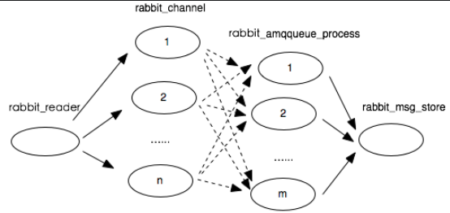

# RabbitMQ Handbook

# **RABBITMQ DEV**

## **CONCEPT**

- PRODUCER：向 MQ 存入 MESSAGE 的对象；
- CONSUMER：从 MQ 中取出 MESSAGE 的对象；
- BROKER：表示 MQ 服务器实体；
- MESSAGE：在 MQ 传输数据的一种封装格式，可以设置的属性如下：
    - ROUTING KEY：设置 MESSAGE 的 ROUTING KEY，从而决定被转发到的 QUEUE；
    - DELIVERY MODE：1) 非持久化； 2) 持久化；
    - HEADERS：当 EXCHANGE 为 HEADER 类型时进行转发过滤；
    - PROPERTIES：设置 MESSAGE 的参数；
        - expiration：设置 MESSAGE 过期时间；
        - priority：设置 MESSAGE 优先级；
- CHANNEL：PRODUCER 和 CONSUMER 和 MQ 进行通信的渠道，是一种建立在 TCP 上的虚拟链接；
- EXCHANGE：类似于路由器，使用 ROUTING KEY 进行路由匹配，从而将 MESSAGE 匹配到相应的 QUEUE 当中；
    - DIRECT：通过 ROUTING KEY 和 QUEUE 绑定在一起。可以绑定一个 QUEUE，也可以同时绑定多个 QUEUE；
    - TOPIC：与 DIRECT 类似，不同的是 DIRECT 采用的是精确匹配，而 TOPIC 采用的是模式匹配；
    - FANOUT：不需要使用 ROUTING KEY，它会将 MESSAGE 路由到所有与其绑定的 QUEUE 中；
    - HEADERS：与其他类型的 EXCHANGE 不同，HEADERS 是通过 MESSAGE 的一些头部信息来分发过滤 MESSAGE，ROUTING KEY在这种类型的 EXCHANGE 中无效；
- BINDING：用于 QUEUE 和 EXCHANE 之间的管理；
- ROUTING KEY：被 EXCHANGE 用于匹配 MESSAGE 转发至 QUEUE 的 KEY；
- QUEUE：存放着等待被 COMSUMER 消费的 MESSAGE；
    - x-max-length：设置 QUEUE 中 MESSAGE 的最大数量，当超过数量时，最先到达的 MESSAGE 将会被删除；
    - x-max-length-bytes：设置 QUEUE 中 MESSAGE 的最大大小，当超过总大小时，最先到达的 MESSAGE 将会被删除；
    - x-dead-letter-exchange：设置 DEAD LETTER QUEUE，当符合某些条件的时候 MESSAGE 将被转发至 DEAD LETTER EXCHANGE；
    - x-dead-letter-exchange-routing-key：设置将 MESSAGE 转到 DEAD LETTER QUEUE 时的 ROUTING KEY。如果没有指定，则采用 MESSAGE 的 ROUTING KEY；
    - x-message-ttl：设置 QUEUE 中 MESSAGE 的 TTL；
    - x-max-priority：设置最高优先级，当 MESSAGE 的优先级超过这个值，只要 MESSAGE 的优先级大于 QUEUE 的最高优先级就可以优先，不做其他区分；
- DURATION：持久化功能，需同时满足 MESSAGE 选择持久化、EXCHANGE 选择持久化、QUEUE 选择持久化；
- ACK：具有 PRODUCER ACK 和 CONSUMER ACK 两种机制；
    - PRODUCER ACK：当 PRODUCER 发送 MESSAGE 到 EXCHANGE，而后进入所匹配的 QUEUE 后或者持久化到磁盘后，通过异步回调的方式通知 PRODUCER；
    - CONSUMER ACK：当 CONSUMER 取出 MESSAGE 或者收到 MESSAGE 的时候，调用 ACK，MQ 中删除该条 MESSAGE，而后继续下一条 MESSAGE 的处理；
- VIRTUAL HOST：类似于权限控制组，一个 VIRTUAL HOST 中可以有若干个 EXCHANGE 和 QUEUE，可以起到隔离 EXCHANGE 和 QUEUE 的效果；


## **WORK MODE**

### **HELLO WORLD**

在 RABBITMQ 中，MESSAGE 永远不能直接发送到 QUEUE，它总是需要经过 EXCHANGE， 而在 HELLO WORLD 模式中，可以指定一个为空字符串的 EXCHANGE，这种 EXCHANGE 是特殊的，它允许我们准确的指定 MESSAGE 应该进入的 QUEUE；

在 HELLO WORLD模式中，只需要指定 EXCHANGE 为空字符串，ROUTING KEY 为所期望的 QUEUE，即可将 MESSAGE 分发至所期望的 QUEUE 中；


### **WORK QUEUES**

WORK QUEUES 与 HELLO WORLD 模式类似，只不过 CONSUMER 的数量不同，通过增加 CONSUMER 可以提高 QUEUE 的消费速度，它们将循环的每次获取一条 MESSAGE；

如果当奇数 MESSAGE 都重，而偶数 MESSAGE 都轻时，其中的一个 WORKER 会一直很忙，另一个 WORKER 几乎不做任何工作。为了解决这种问题，我们可以使用在 CHANNEL 中设置 prefetch_count，来告诉 RABBITMQ 一次不要给一个 WORKER 一个以上的 MESSAGE。换句话说，在 WORKER 处理并确认前一条 MESSAGE 之前，不要向它发送新 MESSAGE。相反，它将把它分派给下一个还不忙的 WORKER；

如果所有的 WORKER 都处在繁忙的状态，QUEUE 可能会填满，这时就需要添加更多的 WORKER 进行 CONSUME， 或者使用 MESSAGE TTL；


### **PUBLISH / SUBSCRIBE**

与 HELLO WORLD 和 WORK QUEUES 模式不同，PUBLISH / SUBSCRIBE 需要指明 EXCHANGE，PRODUCER 没有直接将 MESSAGE 发送到 QUEUE， 而是将 MESSAGE 发送到 EXCHANGE，EXCHANGE 将 MESSAGE 分发到与之绑定的 QUEUE 当中；

PUBLISH / SUBSCRIBE 通常采用 FANOUT 类型的 EXCHANGE 实现；

这种 WORK MODE 可以实现一个 PRODUCER 发送，多个 CONSUMER 消费的效果；


### **ROUTING**

与 PUBLISH / SUBSCRIBE 模式不同，ROUTING 模式采用 DIRECT 的 EXCHANGE 进行路由的转发功能；

ROUTING 模式下，EXCHANGE 根据 MESSAGE 的 ROUTING KEY 进行路由的分发工作。

ROUTING 模式支持多重绑定，用同一个 ROUTING KEY 把多个 QUEUE 绑定在 EXCHANGE 上也是可行的，这样的话会将 MESSAGE 转发至所有符合条件的 QUEUE 中；


### **TOPICS**

在 TOPICS 模式下，EXCHANGE 类型为 TOPIC 模式；

发送到 TOPIC EXCHANGE 的 MESSAGE 可以是一个随意的 ROUTING KEY，它必须是一个单词列表，由点分割。词可以是任何的东西，但通常它们指定与 MESSAGE 相关的一些特征；

ROUTING KEY 的单词可以有任意多个，但是最多不超过 255 个字节；

*：只能替代一个词；

#：可以替代零个或多个单词；


### **RPC**

CLIENT：RPC 模型中的 CLIENT；

SERVER： RPC 模型中的 SERVER；

CLIENT 发送 MESSAGE 给他 SERVER，MESSAGE 中包含两个属性。一个是 reply_to，用于指定 SERVER 回复时 MESSAGE 的接收 QUEUE，CLIENT 一直在监听这个 QUEUE。一个是 correlation_id，本次请求的唯一标识符，当 SERVER 回复时，回复的 MESSAGE 中也会有这个属性，用来与请求 MESSAGE 相对应；

设置一个长期的用于接收 SERVER 回复 MESSAGE 的 QUEUE，如果 CLIENT 不是长期存在，那么这个 QUEUE 就很难管理。而如果 CLIENT 声明一个针对每一对请求的临时 QUEUE，就会造成很大的开销。因此可以在 CLIENT 中指定 reply_to 属性值为 amq.rabbitmq.reply-to，直接将返回的 MESSAGE 发送到等待的 CHANNEL 中，提升异步 RPC 调用的性能。amq.rabbitmq.raply-to 也被称为伪队列；


### **PUBLISHER CONFIRMS**

- 单个确认模式：一种同步确认发布的方式，PRODUCER 在发布一个 MESSAGE 之后，便向 BROKER 发送确认发布请求，只有当这个 MESSAGE 被确认发布之后，才会继续发布之后的 MESSAGE。如果 BROKER 向 PRODUCER 返回确认发布失败的状态，PRODUCER 重新发送这一条 MESSAGE。这种方式的吞吐秒每秒小于 100 条。
- 批量确认模式：工作原理与单个确认模式类似，只不过从一次发送一条 MESSAGE 变为一次发送一批 MESSAGE；
- 异步确认模式：在 PRODUCER 发送 MESSAGE 之前，在 PRODUCER 端设置一个确认发布监听器，用于给 BROKER 端调用，BROKER 将确认发布信息推送给 PRODUCER 端的确认发布监听器。这种模式的好处是消息推送和确认发布监听器是两个独立的线程，不会造成阻塞。同时消息的发送效率较高的；

## **OTHER**

### **TTL**

在 RABBITMQ 中可以对 MESSAGE 和 QUEUE 设置 MESSAGE 的过期时间；

### **DEAD LETTER QUEUE**

在 QUEUE 中使用 x-dead-letter-exchange 参数进行指定 DEAD LETTER EXCHANGE；

在发生如下的情况时，MESSAGE 将会被转发至 DEAD LETTER EXCHANGE，而后被转发至所绑定的且符合条件的 QUEUE 中；

- MESSAGE 被拒绝 或者 NACK，且 requeue = false；
- MESSAGE TTL 到期而被删除；
- 超过 x-max-length 的限制而被删除；
- 超过 x-max-length-bytes 的限制而被删除；

### **DELAY QUEUE**

RABBITMQ 中并没有直接支持延迟队列，如果要支持延迟队列可以使用 DEAD LETTER QUEUE 间接完成。

在 QUEUE 中设置 TTL，而后将 MESSAGE 在一定的时长后转发到 DEAD LETTER EXCHANGE 中，分发至与其绑定的 QUEUE 中，再从 QUEUE 中 CONSUME，从而达到延迟效果；

### **ALTERNATE EXCHANGE**

ALTERNATE EXCHANGE 为 RABBITMQ 自己拓展的功能，不存在于 AMQP 当中；

在创建 EXCHANGE 时使用 alternate-exchange 参数声明所需要指定的 ALTERNATE EXCHANGE。当 MESSAGE 的 ROUTING KEY 在当前的 EXCHANGE 无法匹配到任一 QUEUE 时，MESSAGE 将会被转发至 ALTERNATE EXCHANGE 中，如果在 ALTERNATE EXCHANGE 中也无法被转发至任一 QUEUE，则该条 MESSAGE 将会被丢弃。可以触发 PUBLISH CONFIRM 机制，表示这条 MESSAGE 没有被确认；

### **PRIORITY QUEUE**

QUEUE 可以通过 x-max-priority 参数设置 QUEUE 的最大优先级；

当 MESSAGE 的 priority 在 x-max-priority 之下，则 MESSAGE 的 priority 越高，MESSAGE 就将越先处理。而只要 MESSAGE 的 priority 大于 x-max-priority，则看作它们具有相同优先级，不做其他区分处理；

如果 PRODUCER 生产速度很慢，而 CONSUMER 消费速度很快，则有可能不会严格的按照优先级来进行处理；

# **RABBITMQ OPS**

```
# rabbitmq.conf
# RABBITMQ 内存阈值，当超过的时候，PRODUCER 将会阻塞；
# 建议内存阈值小于 0.5，因为 Erlang GC 在最坏的情况下会消耗一倍的内存；
vm_memory_high_watermark.relative = 0.4 | vm_memory_high_watermark.absolute = 1024MiB
# RABBITMQ 内存分页阈值；
vm_memory_high_watermark_paging_ratio = 0.8
# RABBITMQ 磁盘阈值；
disk_free_limit.absolute = 10000000 | disk_free_limit.absolute = 1 GB | disk_free_limit.relative= 1.0

```

## **PROCESS MODE**

在整个系统中，存在一个 tcp_acceprer 进程，一个 rabbit_msg_store 进程，rabbit_amqqueue_process 进程数量与 QUEUE 数量为一比一关系，每个 CLIENT 连接对应一个 rabbit_reader 和 rabbit_writer 进程；


## **FLOW CONTROL**

RABBITMQ 可以对内存和磁盘的使用量设置阈值，当到达阈值时，PRODUCER 将会被阻塞，直到对应项恢复正常为止。除了这两个阈值以外，RABBITMQ 还使用 FLOW CONTROL 机制来确保稳定性；

ERLANG 进程之间并不共享内存，而是通过 MESSAGE 传递进行通信，每个进程都有自己的进程邮箱，默认没有对进程邮箱的大小进行限制，所有当有大量 MESSAGE 持续发往某个进程时，会导致进程邮箱过大，最终造成 OOM；

在 RABBITMQ 中，如果 PRODUCER 持续高速生产，而 CONSUMER 消费速度较低，如果没有 FLOW CONTROL，很快就会使内部进程邮箱大小达到内存阈值，阻塞 PRODUCER。而后 RABBITMQ 会进行 PAGE 操作，将内存数据持久化到磁盘中；

为了避免这类问题，RABBITMQ 使用了基于信用证的 FLOW CONTROL 机制。消息处理进程有一个信用组 {InitialCredit, MoreCreditAfter}，默认为 {200, 50}。PRODUCER 进程 A 向 CONSUMER 进程 B 发消息，每发一条消息，Credit 数量减 1，直到为 0 为止，PRODUCER 进程 A 被阻塞。对于 CONSUMER 进程 B，每接收 MoreCreditAfter 条消息，会向 PRODUCER 进程 A 发送一条消息，给予 PRODUCER 进程 A MoreCreditAfter 个 Credit，当 PRODUCER 进程 A 的 Credit 大于 0 时，PRODUCER 进程 A 可以继续向 CONSUMER 进程 B 发送消息；



Untitled

## **TIMELY CONSUMPTION**

当 CONSUMER 每隔 500MS 调用一次 amqp_consume_message 接口函数从 socket 上获取数据。正常情况下，服务器每次会推送几百条 MESSAGE ，而且推送的频率比较高，导致 CONSUMER 的 socket 缓冲区存满，MESSAGE 无法进行缓存，而被丢弃；

| 发布消息条数 | 调用 amqp_consume_message 间隔 | 实际接受条数 |
| --- | --- | --- |
| 630 | 500MS | 269 |
| 695 | 470MS | 269 |
| 513 | 460MS | 269 |
| 503 | 450MS | 503 |

## **IDEAL MESSAGE SIZE**

客户端和 RABBITMQ 服务端的最大帧为 128K，但是 MESSAGE 大小却可支持数 MB，这可能是底层做了拆包处理；

在模拟 50 个 PRODUCER 和 50 个 CONSUMER 的情况，MESSAGE 大小由 1K 到 10MB，当MESSAGE的大小到达 4.5MB 时，服务器的性能出现明显的异常，传输率尤其是每秒订阅消息的数量出现波动。同时有一部分 CONSUMER 的 TCP 连接出现断开的现象。因此超过 4MB 的 MEESAGE 最好先进行分包处理；

## **IDEAL NUMBER OF THREAD**

- PRODUCER 使用多线程发送 MESSAGE 到 QUEUE 时三到五个线程性能发送最佳，超过也不能提高发送速率；
- CONSUMER 使用两个线程接收性能是最佳的，如果处理逻辑比较复杂建议多开启几个线程进行 CONSUME；
- 一般情况下 CONSUMER = PRODUCER * 1.5 为较好配置；

## **CLUSTER**

### **METADATA**

METADATA：指包括 QUEUE 名字 / 属性、EXCHANGE 的类型 / 名字 / 属性，BINDING 信息，VHOST 等基础信息，不包括 QUEUE 中的 MESSAGE 数据；

### **MEMORY NODE**

METADATA 存放在内存当中。为了重启后能同步数据，内存节点会将磁盘节点的地址存放于磁盘当中，除此之外，如果 MESSAGE 被持久化也会存放在磁盘当中。由于内存节点读写速度快，一般客户端会连接内存节点；

### **DISK NODE**

METADATA 存放在磁盘中（默认节点类型），需要保证至少一个磁盘节点，否则一旦宕机，无法恢复数据；

### **COMMON CLUSTER MODE**

在 COMMON CLUSTER MODE 下，CLUSTER 中的各个 NODE 之间只会相互同步METADATA，也就是说，MESSAGE 不会被同步。假如我们连接到了 NODE A，而 MESSAGE 存储在 NODE B 该怎么办？

不论是 PRODUCER 还是 CONSUMER，加入连接到的 NODE 上没有存储 QUEUE 数据，那么内部将其转发到存储 QUEUE 数据的节点上进行存储。虽然说内部可以实现转发，但是因为 MESSAGE 仅仅是存储在一个 NODE。假如这个 NODE 宕机了，MESSAGER 也就丢失了；

### **MIRROR QUEUE MODE**

在 MIRROR QUEUE MODE 下，NODE 之间不仅仅会同步 METADATA，MESSAGE 也会在 MIRROR NODE 之间进行同步，可用性更高。这种方案在提高了可用性的同时，因为同步数据之前也会带来一定的网络开销，从而在一定程度上影响到性能；

### **CLUSTER CONFIGURATION**

```
################################ STANDALONE ##############################
# INSTALL RABBITMQ, DEPENDS ON ERLANG
# YOU NEED INSTALL ERLANG FIRST
# YOU NEED INSTALL ERLANG FIRST
# YOU NEED INSTALL ERLANG FIRST
wget <https://dl.bintray.com/rabbitmq/all/rabbitmq-server/3.8.4/rabbitmq-server-generic-unix-3.8.4.tar.xz>
xz -d rabbitmq-server-generic-unix-3.8.4.tar.xz
tar -xvf rabbitmq-server-generic-unix-3.8.4.tar

# THEN CONFIGURE THE PATH VARIABLE
#LIKE: export PATH=$PATH:/RABBITMQ/INSTALL/PATH/sbin

# START RABBITMQ SERVICE
rabbitmq-server -detached
# CREATE USER
rabbitmqctl add_user {{USERNAME}} {{PASSWORD}}
# ADD TAG
rabbitmqctl set_user_tags admin administraotr
# SET PERMISSION
rabbitmqctl set_permissions -p / amdin ".*" ".*" ".*"
# ENABLE WEB MANAGEMENT PLUGIN, DEFAULT PORT: 15672
rabbitma-plugins enable rabbitmq_management
# LIST CONNECTION
rabbitmqctl list_connections
# LIST QUEUE
rabbitmqctl list_queues
# LIST CHANNELS
rabbitmqctl list_channels
# LIST USER
rabbitmqctl list_users

################################ CLUSTER ##############################
# MODIFY /etc/hosts ON ALL NODES
192.168.1.10 master master.rabbitmq.com
192.168.1.11 node01 node01.rabbitmq.com
192.168.1.12 node02 node02.rabbitmq.com

# SYNC COOKIE
scp /var/lib/rabbitmq/.erlang.cookie root@node01:/var/lib/rabbitmq/.erlang.cookie
scp /var/lib/rabbitmq/.erlang.cookie root@node02:/var/lib/rabbitmq/.erlang.cookie
# RESTART RABBITMQ SERVICE ON SLAVE NODE
systemctl stop rabbitmq-server.service
systemctl start rabbitmq-server.service
# ALL NODES START WITH -detached ARGUMENT
rabbitmqctl stop
rabbitmq-server -detached
# LET node01 AND node02 JOIN THE CLUSTER
rabbitmqctl stop_app
rabbitmqctl join_cluster rabbit@master
rabbitmqctl start_app
# IF YOU WANT THE NODE TO JOIN THE CLUSTER AS A MEMORY NODE
rabbitmqctl join_cluster --ram rabbit@master
# IF YOU WANT TO LEAVE CLUSTER, RUN ON THE MASTER NODE
rabbitmqctl forget_cluster_node rabbit@{{NODE_NAME}}
# VIEW THE CLUSTER STATUS ON THE MASTER NODE
rabbitmqctl cluster_status

# SET MIRROR QUEUE POLICY AND HAPROXY
# COPY TO ALL NODES, EXECUTE ON ANY NODE
rabbitmqctl set_policy {{POLICY_NAME}} "^" '{"ha-mode":"all"}'
# COPY THE MATCHED QUEUES TO ANY TWO OR MORE NODES IN THE CLUSTER,
# NOT TO ALL NODES, AND PERFORM AUTOMATIC SYNC.
rabbitmqctl set_policy {{POLICY_NAME}} "^" '{"ha-mode":"exactly","ha-params":2,"ha-sync-mode":"automatic"}'
# COPY THE MATCHED QUEUE TO THE SPECIFIED NODE IN THE CLUSTER
rabbitmqctl set_policy {{POLICY_NAME}} "^" '{"ha-mode":"nodes","ha-params":["rabbit@node01","rabbit@node02"]}'

# INSTALL HAPROXY ON node2
yum install haproxy -y
# MODIDY HAPROXY CONFIG FILE
# vim /etc/haproxy/haproxy.cfg
global
    log         127.0.0.1 local2

    chroot      /var/lib/haproxy
    pidfile     /var/run/haproxy.pid
    maxconn     4000
    user        haproxy
    group       haproxy
    daemon

    stats socket /var/lib/haproxy/stats

defaults
    mode                    tcp
    log                     global
    option                  tcplog
    option                  dontlognull
    retries                 3
    timeout http-request    10s
    timeout queue           1m
    timeout connect         10s
    timeout client          1m
    timeout server          1m
    timeout http-keep-alive 10s
    timeout check           10s
    maxconn                 3000

listen rabbitmq_cluster 0.0.0.0:5670
    mode tcp
    balance roundrobin
    server node1 192.168.1.10:5672 check inter 2000 rise 2 fall 3
    server node2 192.168.1.11:5672 check inter 2000 rise 2 fall 3
    server node3 192.168.1.12:5672 check inter 2000 rise 2 fall 3

listen monitor 0.0.0.0:8100
    mode http
    option httplog
    stats enable
    stats uri /stats
    stats refresh 5s

# RESTART HAPROXY
systemctl restart haproxy.service
# THEN YOU CAN VISIT THIS URL TO CHECK THE EFFECT
<http://192.168.1.12:8100/stats>

```

### **HAPROXY**

HAPROXY 是一个开源的、高性能负载均衡软件，它支持 4 层代理模式和 7 层代理模式。在 4 层模式下， HAPROXY 仅在客户端和服务器之间转发双向流量。在 7 层模式下，HAPROXY 会分析协议 ，并且能够允许、拒绝、交换、增加、修改请求或者响应里指定内容来控制协议，这种操作要基于特定的协议；

HAPROXY 可以很容易地与 RABBITMQ 进行整合，同时可以搭配 KEEPALIVED 能够确保 CLUSTER 的高可用性；

# **DONE**