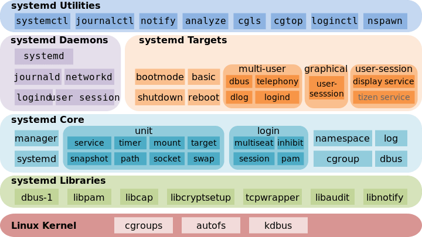

# Systemd Handbook




# Systemd

## 介绍

systemd 是一系列工具的集合，其作用也远远不仅是启动操作系统，它还接管了后台服务、结束、状态查询，以及日志归档、设备管理、电源管理、定时任务等许多职责。

## 特点

- 更少的进程，提供了服务按需启动的能力；
- 允许更多的进程进行启动；
- 使用 cgroup 跟踪和管理进程的生命周期；
- 统一管理服务日志；

## systemd 资源

systemtd 可以管理所有的系统资源，不同的资源统称为 unit。

| Type | Description |
| --- | --- |
| service | 服务，封装守护进程的启动、停止、重启和重载操作，是最常见的一种 Unit 文件 |
| socket | 套接字，监控来自于系统或网络的数据消息，用于实现基于数据自动触发服务启动 |
| device | 设备，对于 /dev 目录下的设备，主要用于定义设备之间的依赖关系 |
| mount | 挂载点，定义系统结构层次中的一个挂载点，可以替代过去的 /etc/fstab 配置文件 |
| automount | 自动挂载点，用于控制自动挂载文件系统，相当于 SysV-init 的 autofs 服务 |
| swap | 交换分区或交换文件，定义一个用户做虚拟内存的交换分区 |
| target | 启动目标，用于对 Unit 文件进行逻辑分组，引导其他 Unit 的执行。它替代了 SysV-init 运行级别的作用，并提供更灵活的基于特定设备事件的启动方式 |
| path | 被监视的路径，用于监控指定目录或文件的变化，并触发其他 Unit 运行 |
| timer | 任务计划，用于配置在特定时间触发的任务，替代了 Crontab 的功能 |
| slice | 资源控制组，用于表示一个 CGroup 的树，通常用户不会自己创建这样的 Unit 文件 |
| scope | 一组外部创建的进程，这种 Unit 文件不是用户创建的，而是 Systemd 运行时产生的，描述一些系统服务的分组信息 scope.scope |

## 管理工具

### systemctl

systemctl 是 systemd 的主要命令，用于系统与服务的管理。

```
systemctl reboot # 重启系统
systemctl enable nginx.service # 设置启用服务
systemctl start nginx.service # 设置服务启动
systemctl disable nginx.service # 设置禁用服务
systemctl stop nginx.service # 设置服务停止
systemctl status nginx.service # 查看服务状态
systemctl daemon-reload # 重新加载 unit 配置
systemctl reload nginx.service # 重新加载一个服务的配置文件
systemctl kill nginx.service # 杀死一个服务的所有子进程
systemctl show-environment # 查看 systemd manager 环境块
systemctl list-units # 列出 systemd 当前在内存中的 unit
systemctl list-units --type=service # 列出所有类型为 service 的 unit
systemctl list-denpendecies nginx.service # 查看 unit 的依赖关系
systemctl show nginx.service # 查看 unit 的所有底层参数
systemctl reset-failed # 重新加载 unit 并且将 systemd 已缓存的 unit 重置
```

### systemd-analyze

systemd-analyze 用于分析和调试系统管理。

```
systemd-analyze time # 查看启动耗时
systemd-analyze blame # 查看每个服务的启动耗时
systemd-analyze critical-chain # 显示瀑布状的启动过程流
systemd-analyze critical-chain dbus.socket # 显示指定服务的启动流
```

### timedatectl

timedatectl 系统时间和日期查看与管理。

```
timedatectl # 查看当前时区设置
timedatectl list-timezones # 显示所有可用的时区
timedatectl set-timezone Asia/Shanghai # 设置系统时区
timedatectl set-time "2023-12-23 13:08:00" # 设置系统时间
timedatectl set-ntp true # 设置网络时间同步，前提需安装 timesyncd ｜ ntpd ｜ chrony
```

### hostnamectl

hostnamectl 可用于查询和更改系统主机名和相关设置。

```
hostnamectl stauts # 查看主机信息
hostnamectl set-hostname {{HOSTNAME}} # 设置主机名
```

### journalctl

journalctl 系统日志管理器

```
journalctl # 查看所有日志
journalctl -u network.service # 查看指定 unit 日志
journalctl -k # 查看 kernel 日志
journalctl -b # 查看系统本次启动日志
journalctl -n {{NUMBER}} # 查看尾部指定函数日志
journalctl -f # 滚动显示最新日志
journalctl /usr/lib/systemd/sysemtd # 查看指定服务的日志
journalctl _PID=1 # 查看指定进程的日志
journalctl /usr/bin/bash # 查看指定路径的脚本日志
journalctl _UID=0 --since today # 查看指定用户的日志，从今天开始
```

### loginctl

loginctl 系统登管理器

```
loginctl list-users # list-users
loginctl show-user root # 列出显示制定用户的信息
loginctl list-sessions # 列出所有 session
loginctl show-session {{SESSION_ID}} # 查看 session 详情
loginctl kill-session {{SESSION_ID}} # 杀死指定 session
```

## Systemd 资源文件编写

### service unit

```
# [Unit]区块包含与单元类型无关的通用信息
[Unit]
Description=Foo
# Description：有利于人类阅读的、对单元进行简单描述的字符串。
# Documentation：一组用空格分隔的文档URI列表， 这些文档是对此单元的详细说明。
# Requires：设置此单元所必须依赖的其他单元。
# Wants：此选项是 Requires= 的弱化版。
# BindsTo：与 Requires= 类似，但是依赖性更强
# Before, After：强制指定单元之间的先后顺序，接受一个空格分隔的单元列表。
# Conflicts：指定单元之间的冲突关系。表明该单元不能与列表中的任何单元共存

# [Service]区块包含服务启动信息
[Service]
ExecStart=/usr/sbin/foo-daemon
# Type：设置进程的启动类型。取值为 simple, exec, forking, oneshot, dbus, notify, idle 之一。
# RemainAfterExit：当该服务的所有进程全部退出之后， 是否依然将此服务视为活动(active)状态。 默认值为 no
# PIDFile：该服务PID文件的路径(一般位于 /run/ 目录下)。 强烈建议在 Type=forking 的情况下明确设置此选项。
# BusName：设置与此服务通信 所使用的 D-Bus 名称。
# ExecStart：在启动该服务时需要执行的 命令行(命令+参数)，命令行必须以一个可执行文件(要么是绝对路径、要么是不含任何斜线的文件名)开始， 并且其后的那些参数将依次作为"argv[1] argv[2] …"传递给被执行的进程。
# ExecReload：这是一个可选的指令， 用于设置当该服务 被要求重新载入配置时 所执行的命令行。
# ExecStop：这是一个可选的指令， 用于设置当该服务被要求停止时所执行的命令行。
# Restart：当服务进程 正常退出、异常退出、被杀死、超时的时候， 是否重新启动该服务。所谓"服务进程" 是指 ExecStartPre=, ExecStartPost=, ExecStop=, ExecStopPost=, ExecReload= 中设置的进程。
# Environment：指定环境变量
# User：指定运行服务的用户
# Group：指定运行服务的用户组
# WorkingDirectory：指定服务的工作目录

# [Install]区块包含单元的启用信息
[Install]
WantedBy=multi-user.target
# Alias：启用时使用的别名，可以设为一个空格分隔的别名列表。
# WantedBy：它的值是一个或多个 Target，当前 Unit 激活时（enable）符号链接会放入/etc/systemd/system目录下面以 Target 名 + .wants后缀构成的子目录中
# RequiredBy：它的值是一个或多个 Target，当前 Unit 激活时，符号链接会放入/etc/systemd/system目录下面以 Target 名 + .required后缀构成的子目录中
# Also：设置此单元的附属单元，表示当使用 systemctl enable 启用 或 systemctl disable 停用 此单元时， 也同时自动的启用或停用附属单元。
```

## Unit 文件加载

systemd 将会从一组在编译时设定好的 unit 目录中加载单元文件，目录拥有不同的优先级。高优先级目录中的文件， 将会覆盖低优先级目录中的同名文件。

- 当 systemd 以系统实例（–-system）运行时，加载单元的先后顺序（较前的目录优先级较高）

| 系统单元目录 | 描述 |
| --- | --- |
| /run/systemd/transient | 动态配置的临时单元（系统与全局用户共用） |
| /etc/systemd/system | 本地配置的系统单元 |
| /run/systemd/system | 运行时配置的系统单元 |
| /usr/lib/systemd/system | 本地软件包安装的系统单元 |
| /usr/lib/systemd/system | 发行版软件包安装的系统单元 |
- 当 systemd 以用户实例（–user）运行时，加载单元的先后顺序（较前的目录优先级较高）

| 系统单元目录 | 描述 |
| --- | --- |
| /etc/systemd/user | 本地配置的全局用户单元 |
| /run/systemd/user | 运行时配置的全局用户单元 |
| /usr/lib/systemd/user | 本地软件包安装的全局用户单元 |
| /usr/lib/systemd/user | 发行版软件包安装的全局用户单元 |