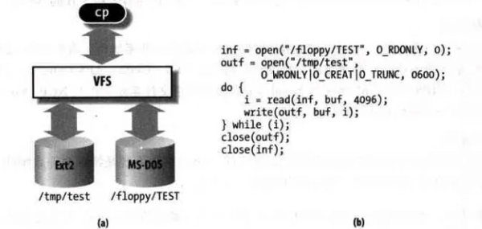
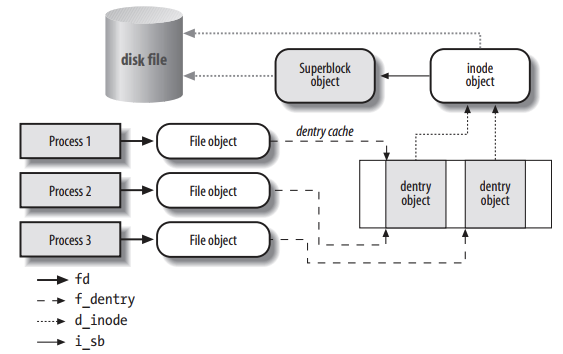

# VFS Handbook

## 介绍

Linux 采用 Virtual File System（VFS）的概念，通过内核在物理存储介质上的文件系统和用户之间建立起一个虚拟文件系统的软件抽象层，使得 Linux 能够支持目前绝大多数的文件系统，不论它是 windows、unix 还是其他一些系统的文件系统，都可以挂载在 Linux 上供用户使用。

## 支持的文件类型

VFS 在 Linux 中是一个处理所有 unix 文件系统调用的软件层，同时给不同类型的文件系统提供一个统一的接口。VFS 支持以下归类的三种类型的文件系统：

- 磁盘文件系统，存储在本地磁盘、U盘、CD等的文件系统，它包含各种不同的文件系统格式，比如 windows NTFS、VFAT，BSD 的 UFS，CD的 CD-ROM 等
- 网络文件系统，它们存储在网络中的其他主机上，通过网络进行访问，例如 NFS
- 特殊文件系统，例如 /proc、sysfs 等

## 文件模型

VFS 背后的思想就是建立一个通用的文件模型，使得它能兼容所有的文件系统，这个通用的文件模型是以 Linux 的文件系统 EXT 系列为模板构建的。每个特定的文件系统都需要将它的物理结构转换为通用文件模型。例如，通用文件模型中，所有的目录都是文件，它包含文件和目录；而在其他的文件类型中，比如 FAT，它的目录就不属于文件，这时，内核就会在内存中生成这样的目录文件，以满足通用文件模型的要求。同时，VFS 在处理实际的文件操作时，通过指针指向特定文件的操作函数。可以认为通用文件模型是面向对象的设计，它实现了几个文件通用模型的对象定义，而具体的文件系统就是对这些对象的实例化。通用文件模型包含下面几个对象：

- **superblock：** 存储挂载的文件系统的相关信息；
- **inode：** 存储一个特定文件的相关信息；
- **file：** 存储进程中一个打开的文件的交互相关的信息；
- **dentry：** 存储目录和文件的链接信息。

这几个通用文件模型中的对象之间的关系如下图所示：

VFS 除了提供一个统一文件系统接口，它还提供了名为 dentry cache 的磁盘缓存，用于加速文件路径的查找过程。磁盘缓存将磁盘中文件系统的一些数据存放在系统内存中，这样每次访问这样的数据就不需要操作实际的物理磁盘，可以大大提高访问性能。

### Superblock

superblock 由 `super_block` 结构体存储，所有的 superblock 都通过一个双向链表链接在一起，这个链表的头是 `super_blocks` 。通过 `sget` 或者 `sget_fc` 向这个链表中添加 superblock。对于 superblock 的方法存放在 `super_operations` 数据结构中。这其中包含了对这种文件类型的各种的基础操作，比如 `write_inode` & `read_inode`。`s_dirt` 标志用于指示 superblock 是否与磁盘中的 superblock 一致，如果不一致，则需要进行同步。

### Inode

文件系统中用于操作文件的所有信息都存储在 inode 这样一个数据结构中。对于一个文件而言，它的文件名只是一个标签，是可以改变的，但是 inode 是不变的，它对应着一个真正的文件。inode 中的 `i_state` 用于指示当前 inode 的状态，有下面一些比较常见的标志：

- I_DIRTY：与磁盘中的内容不一致，需要同步；
- I_LOCK：在进行 IO 操作；
- I_FREEING：这个 inode 已经被 free 了；
- I_CLEAR：inode 中的内容已经没有意义了；
- I_NEW：这个 inode 是新建的，里面还没有与磁盘中的数据进行同步；

每个 inode 会被链接进下面三个链表中（通过 inode 中的 i_list 进行链接）：

- unused inodes：i_count 为0，也就是没有被引用，并且它是 no dirty 的。链表头是 `inode_unused`；
- in-use inodes：i_count > 0 并且是 no dirty 的，链表头是 `inode_in_use`；
- dirty inodes：链表头是 superblock 中的 `s_dirty`；

同时，属于同一个文件系统的 inode 会通过 `i_sb_list` 字段链接到一个链表中，这个链表的头存放在 superblock 中 `s_inodes` 字段。为了加快查找速度，inode 存放在一个 `inode_hashtable` 的 hash 表中，其中的 `i_hash` 则用于 hash 查找冲突时的链表。inode 的方法则存放在 `inode_operations` 结构数据中。

### File

file 是用于进程与文件之间进行交互的一个数据结构，它是一个纯软件的对象，没有关联的磁盘内容，所以它没有 dirty 的概念。file 中最重要的内容是文件指针，也就是当前文件的操作位置。同一个文件可能被不同的进程打开，它们都是对同一个 inode 进行操作，不过由于文件指针的不同，它们操作的位置也就不一样。file 结构体通过一个 `flip` 的 slab cache 进行分配。所以 file 的数目存在一个限制，它通过 `files_stat` 中 `max_files` 指示最大的可分配的 file 的数量。in-use file 被链接在属于各自文件系统的 superblock 中，链表的头是 `s_files` 。`f_count` 字段则记录着文件被引用的计数。

VFS 在操作文件时候，类似面向对象中多态概念，不同的文件系统会关联不同的 file operations 。这样 VFS 统一的文件操作接口存放在 file 中的 `f_op` 中。当打开一个文件的时候，VFS 会根据 inode 中的 `i_fop` 对 f_op 进行初始化，而在之后的操作中，VFS 可能会更改 f_op 中的值，也就是改变文件操作的行为。

### Dentry

在 VFS 的统一文件模型中，目录也是被当作文件的，它有着对应的 inode 。每当一个目录项被读入内存的时候，就会通过一个 dentry 的结构数据存放，它通过 `dentry_cache` 的 slab cache 进行分配。

每个 dentry 可能存在下面4种状态：

- free：VFS没有在使用，只是一个空的空间
- unused：d_count = 0，不过里面的数据还是有效的，这样的 dentry 会按顺序被回收
- in-use：d_count > 0，数据有效，正在被系统所使用
- negative：d_count > 0，d_inode = NULL，也就是这个 dentry 没有关联的 inode，不过它依旧在路径查找中被使用

unused dentry 会被链接到一个 LRU 链表中，当 dentry cache 需要 shrink 的时候，就会从这个链表的尾部回收空间。这个 LRU 链表的头是 `dentry_unused` ，通过 dentry 中的 d_lru 字段进行链接。in-use dentry 则会被链接到 inode 中的 i_dentry 链表，这是因为同一个 inode 可能存在好几个硬链接。同时为了加快目录的查找，dentry 也会被加入到名为 `dentry_hashtable` 的 hash 表中。

每一个进程，都有一个 fs_struct 结构数据，用于存放 root 目录、当前目录等文件相关的信息。还有一个 file_struct 的数据结构用于存放进程打开的文件相关信息。file_struct 中的 fd 字段是一个指向当前进程打开的文件的一个数组，这个数据的大小由 max_fds 字段指示。这个数组的默认大小是 32，如果打开的文件多于这个数，那么就会重新开辟一个大的数组进行扩展。我们在用户态的文件描述符就是这个数组的序号，通常0号文件是标准输入，1号文件是标准输出，2号文件是错误输出。通过 dup()、fcnt() 这样的系统调用，我们可以让这个数组不同的序号指向同一个文件。一个进程能打开的文件数是有限制的，在运行过程中，这个最大值由 signal->rlim[RLIMIT_NOFILE] 指示，它可以在运行时动态的修改，默认值是 1024。而在代码中，NR_OPEN 这个宏指示着进程所能支持的最大的文件打开数。在 file_struct 中 open_fds 是一个用来标志打开文件序号的数组，这个数组中的每个 bit 表示对应序号的文件是否被打开，max_fdset 指示着这个数组的长度，它的默认值是 1024 个 bit。如果打开的文件数超过这个值，那么就需要动态扩展这个数组的大小。

内核中通过 `fget` 函数来引用文件，它将返回 current->files->fd[fd]，同时增加 f_count 的计数，释放文件则通过 `fput` 函数，它将减少 f_count 计数，如果减少到0，内核将调用 release 方法做真正的释放动作。

## 文件系统类型

相对于以网络和磁盘为载体的文件系统，特殊文件系统是一些数据的集合，利用了 VFS 的接口，方便内核或者用户的使用。常见的特殊文件系统有：rootfs、proc、sysfs、pipefs、tmpfs等。这些特殊的文件系统没有物理载体，不过内核中把它们都统一分配一个虚拟的块设备（编号为0）。这些特殊的文件系统通过调用 `set_anon_super` 函数来初始化 superblock。

file_system_type 是用于存放注册到内核的文件系统类型的信息的数据结构，所有的 file_system_type 链接在一个单向链表中，表头是 `file_systems` 。字段 `fs_supers` 则是这个文件类型下所有的 superblock 的链表。`get_sb` & `kill_sb` 则是用于构建和销毁 superblock 的方法。

文件系统通过调用 `register_filesystem` & `unregister_filessytem` 函数实现文件系统在内核的注册和注销。

rootfs 文件系统是内核在启动阶段注册的，它包含了文件系统初始化的脚本以及一些重要的系统程序。其他的文件系统则可以通过脚本或者命令 mount 到系统的目录节点中。

## Namespaces

通常的 unix 系统中，只有一棵文件系统树，都是从 rootfs 这个根开始，进程通过在这个文件树中特定的路径名访问文件。而在 Linux 中，引入了 namespace 的概念，也就是每一个进程都可以有自己的一个文件系统树。通常进程都是共享系统中的 rootfs（也就是 init 进程的 namespace ）。不过如果在 clone() 系统调用的时候，设置了 CLONE_NEWNS 标志，那么这个进程就会创建一个新的 namespace，通过 pivot_root() 系统调用可以修改进程的 namespace。不同 namespace 之间的文件系统 mount & unmount 互不影响。

进程中的文件系统 namespace 信息通过一个 namespace 数据结构进行存储。list 字段是一个链接了所有属于这个 namespace 的文件系统的链表，而 root 字段则是表示这个 namespace 的根文件系统。

在 Linux 中，文件系统的 mount 具有以下一些特性：

- 同一个文件系统可以被多次 mount 到不同的路径点，这样同一个文件系统可以通过不同的路径进行访问，不过代表这个文件系统的 superblock 只会有一个；
- mount 的文件系统下的路径可以 mount 其他的文件系统，以此类推，可以形成一个 mount 的等级图；
- 同一个路径点，可以被栈式地进行 mount，新的文件系统被 mount 后就会覆盖老的文件系统的路径，而 unmount 之后，路径又会恢复之前一个的文件系统；

用于存储这些 mount 的关系信息的数据结构叫做 `vfsmount` ，vfsmount 数据被链接在下面这些链表中：

- 所有的 vfsmount 加入到 `mount_hashtable` hash表中；
- 对于每一个 namespace ，通过一个环形链表，链接属于自己的 vfsmount；
- 对于每一个文件系统，通过一个环形链表，链接 mount 到自己路径下的子文件系统 vfsmount；

## Mount 根文件系统

根文件系统的 mount 过程分为2个阶段：

- 内核 mount 一个特殊的文件系统——rootfs，它提供了一个空的路径作为初始的挂载点；
- 内核 mount 实际的文件系统系统，覆盖之前的空路径；

内核之所以搞一个 rootfs 这样一个特殊的文件系统，而不是直接使用实际的文件系统作为根文件系统，其原因是为了方便在系统运行时更换根文件系统。目前用于启动的 Ramdisk 就是这样一个例子，在系统起来后，先加载一个包含最小驱动文件和启动脚本的 Ramdisk 文件系统作为根文件系统，然后将系统中其他的设备加载起来后，再选择一个完整的文件系统替换这个最小系统。

## 文件路径查找

文件路径查找的简单过程：文件路径通过 `/` 划分为一个个的目录项，查找到匹配的目录，然后读取它的 inode ，寻找到符合下一级路径的目录，如此循环，直到最后。dentry cache 的机制可以加快对于目录项的访问速度。然而Linux中下面的这些特性，让这个循环查找的过程变得非常复杂：

- 每一级路径需要匹配用户的访问权限；
- 一个文件名可能是任意一个路径的软链接；
- 软链接可能存在循环引用的情况，需要发现并打破这样的无限循环；
- 一个路径名可以是另一个文件系统的挂载点；
- 路径名需要在进程的 namespace 中查找，不能超出这个范围；

## 文件锁

当一个文件可以被多个进程同时访问的时候，同步的问题就产生了。POSIX 标准是要求通过 fcntl() 系统调用实现一个文件锁的机制，这样就能避免竞争关系。这个文件锁可以对整个文件或者文件中的某个区域（小到一个字节）进行锁定，由于可以锁文件的部分内容，所以一个进程可以同时获取同一个文件的多个锁。

POSIX 标准的这种文件锁被称之为 advisory lock，就跟用于同步的信号量一样，只有双方约定在访问临界区的时候都先查看一下锁的状态，这种同步机制才能实现，如果某个进程单方面不获取锁的状态就直接操作临界区，那么这个锁是管不住的。与劝告锁相对的就是强制锁。

在 Linux 中可以通过 fcntl() & flock() 系统调用对文件进行上锁。通常在类 unix 系统中，flock() 系统调用会无视 MS_MANDLOCK 的挂载标志，只产生劝告锁。

Linux 对于劝告锁和强制锁都有实现。一个进程获取劝告锁的方式有2种：

- 通过 flock() 系统调用，这个锁只能对整个文件上锁；
- 通过 fcntl() 系统调用，可以对文件的特定部分进行上锁；

一个进程获取强制锁比较麻烦，需要下面几个步骤：

- mount 文件系统的时候，添加强制锁的标志 MS_MANDLOCK，也就是 mount 命令添加 `o` 选项。mount 的默认情况下是不带这个标志的；
- 使能 Set-Group-ID，清除 Group-Execute-Bit ，`chmod g+s,g-x xxx.file`；
- 使用 fcntl() 系统调用，获得强制锁；

fcntl() 系统调用还支持一种名为 lease 的强制锁，A进程在访问被B进程上锁的文件时，A进程会被阻塞，同时B进程会收到一个信号，此时B进程应该尽快处理完并主动释放文件锁。如果在一定时间内（/proc/sys/fs/lease-break-time中配置，通常是45s）B进程还没有释放这个锁，那么这个锁就会被内核自动释放掉，此时A进程就能继续访问这个文件了。

fcntl() 是 POSIX 标准的用于文件锁的系统调用，而 flock() 是许多其他类 unix 系统中实现的系统调用，Linux 对这2者都支持。它们的锁也是互不影响的，也就是通过 fcntl() 上的锁对 flock() 是无效的，反之亦然，之所以这样，是为了防止不同的用户程序使用不同的接口，会导致死锁的情况发生。

由于强制锁会带来一些程序兼容性的问题，所以一般不鼓励使用强制锁，并且 Linux 中的强制锁还存在一些 bug，会导致无法真正地实现全面的强制锁，同时从 4.5版本开始，强制锁已经变成一个可配置的选项，在后面的内核版本中将会移除这个特性。